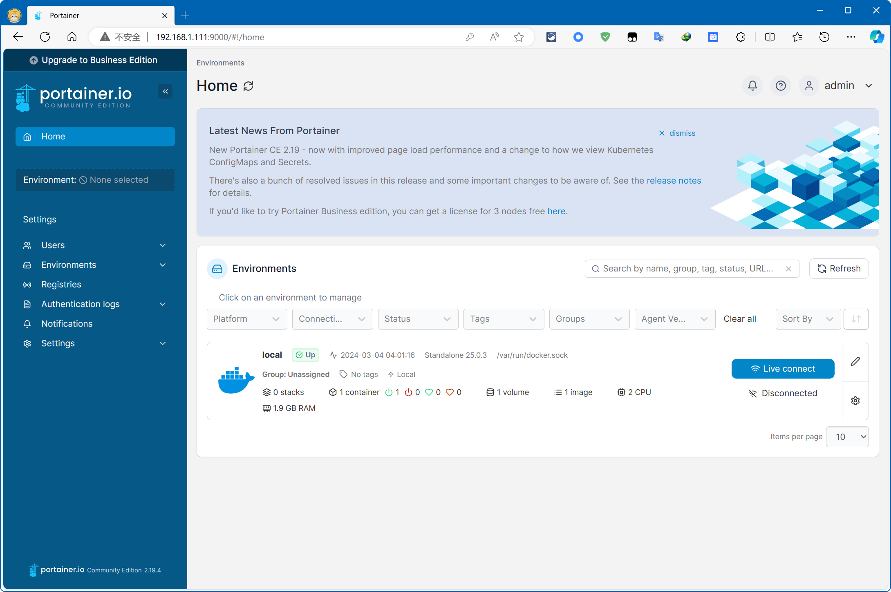
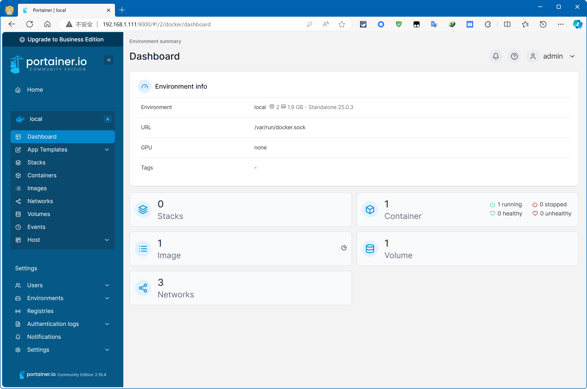

### 概述

本篇为教学如何在 CentOS 7.9 中安装 docker-ce，及介绍 docker 基本的使用方法。

### 版本环境

- VMware Workstation 16 Pro（16.2.3 build-19376536）
- CentOS 7.9（CentOS-7-x86_64-DVD-2009）
- Docker CE 26.0.0

### 权限问题

安装配置的过程中几乎都需要使用到管理员权限，这里建议切换为 root 用户来执行以下操作。普通用户在 CentOS 7 中想要获取管理员权限会稍微有点麻烦，因为 CentOS 7 默认并不允许普通用户使用 sudo 命令。

要解决这个问题，需要管理员手动将指定普通用户添加到 sudoers 文件中。假设 mike 为普通用户，这里要将其添加到 sudoers 文件中。以管理员身份登录到系统，或者使用拥有 sudo 权限的用户登录，接着编辑 sudoers 文件：

```bash
sudo visudo
```

在打开的文件中找到以下行：

```
## Allow root to run any commands anywhere
root    ALL=(ALL)       ALL
```

在该行的下方添加以下行，以允许用户 mike 使用 sudo 命令：

```
mike    ALL=(ALL)       ALL
```

保存并退出编辑器。现在，用户 mike 应该可以使用 sudo 命令并输入自己的密码来获取管理员权限了。

### 主要原因

在 CentOS 7 不再接收官方更新和维护后，会影响到系统中的软件包，包括 docker。这可能导致 CentOS 7 的默认软件源中提供的 docker 版本变得过时，因为它们不再接收新的更新和功能改进。

此外，CentOS 7 的官方 yum 源通常只提供与 CentOS 7 兼容的软件包，而不是最新版本的软件包。因此，即使在 CentOS 7 还在维护更新阶段时，yum 源提供的 docker 版本也可能相对较旧，这可能导致 docker 版本不足以支持某些新功能或软件。

就目前的情况而言，CentOS 7.9 中的 yum 源所提供的 docker 已经停留在了 1.13.1 版本：

```
~]# docker --version
docker version 1.13.1, build 7d71120/1.13.1
```

类似于 Nginx、MySQL 这些软件的最新版本已不再支持低版本的 docker 了。

因此，将 docker 更新到 Docker CE 是一个解决方案，因为 Docker CE 是由 Docker 社区提供的、针对最新特性和功能的版本，而不仅仅是 CentOS 7 默认软件源中提供的版本。这样做可以确保获得最新的 docker 功能、安全性和性能改进，并且与最新的容器化应用程序兼容。

### 添加新源

Docker CE 是 Docker 社区版的简称，是由 Docker 社区维护和支持的免费、开源的 Docker 版本。要安装 Docker CE，您需要添加适当的 YUM 软件源到您的系统中，然后使用 `yum` 命令来安装 Docker CE。

```bash
# step 1: 安装 yum-utils 系统工具
sudo yum install -y yum-utils

# Step 2: 添加软件源信息
sudo yum-config-manager --add-repo https://download.docker.com/linux/centos/docker-ce.repo
```

其中 `yum-utils` 是一个 CentOS 或 Red Hat Enterprise Linux (RHEL) 等系统上的一个工具集合，用于增强和扩展 YUM 包管理器的功能。它包含了一系列的命令行工具，可以帮助用户更有效地管理软件包。

这里只使用了 `yum-utils` 工具集中 `yum-config-manager` 工具来添加新的 yum 软件源，这里添加的是 docker-ce 源。

### 安装 docker-ce

```bash
# step 1: 刷新 yum 软件包管理器缓存
sudo yum makecache fast

# step 2: 安装 docker-ce
sudo yum install -y docker-ce
```

### 替换 docker 源

如果已经将 docker 更新至 docker-ce，那么使用 docker-ce 从 Docker Hub 拉取镜像时，一般不会出现从前的连接困难的情况。

但如果不可避免出现了网络故障：

```
~]# docker pull nginx
Using default tag: latest
Trying to pull repository docker.io/library/nginx ...
missing signature key
```

那么可以选择为 Docker Hub 配置镜像加速器。推荐使用[阿里云镜像加速器](https://cr.console.aliyun.com/cn-hangzhou/instances/mirrors)，需要注意使用阿里镜像加速需要注册并登录阿里云账号。

获取到加速地址后，需配置 Docker Hub 的镜像源，添加或编辑 daemon.json 文件：

```bash
# 编辑 daemon.json
vim /etc/docker/daemon.json
```

添加以下配置并保存 daemon.json 文件。

```
{
  "registry-mirrors": ["https://9cpn8tt6.mirror.aliyuncs.com"]
}
```

重新载入 daemon.json 文件，并重启 docker 服务：

```bash
# step 1: 重新载入 daemon.json 文件
systemctl daemon-reload
# step 2: 重启 docker 服务
systemctl restart docker
```

### docker 代理

如果在拉取镜像时，由于不可控原因导致镜像加速器无法使用，或不可避免地出现了网络故障，则推荐使用代理服务来解决 docker 拉取镜像的问题。

CentOS 中可以使用环境变量来配置代理（不仅仅只支持以下类型的代理）：

```bash
export HTTP_PROXY="http://192.168.1.188:13766"
export HTTPS_PROXY="http://192.168.1.188:13766"
export NO_PROXY="localhost,127.0.0.1"
```

其中：

- `HTTP_PROXY`：HTTP 代理的地址和端口；
- `HTTPS_PROXY`：HTTPS 代理的地址和端口；
- `NO_PROXY`：不使用代理的地址。

注意，上述代理配置为临时配置，系统重启后配置会失效，且**只有 HTTP 和 HTTPS 请求才会使用该代理**。

以下代码用于测试代理可用性：

```shell
curl -I https://www.google.com
```

但实际上 docker 并无法直接使用环境变量中配置的代理。因为镜像的拉取和管理都是 docker daemon 的职责，而 docker daemon 是由 systemd 管理的，因此为 docker 配置代理要从 systemd 配置入手。具体步骤如下：

1. 创建 dockerd 相关的 systemd 目录，该目录下的配置将覆盖 dockerd 的默认配置：

```shell
mkdir -p /etc/systemd/system/docker.service.d
```

2. 新建配置文件 `/etc/systemd/system/docker.service.d/http-proxy.conf`，在文件中配置环境变量：

```
[Service]
Environment="HTTP_PROXY=http://192.168.1.188:13766"
Environment="HTTPS_PROXY=http://192.168.1.188:13766"
```

3. 代理一旦配置，则所有的请求都会优先使用代理服务。如果有需要绕过代理，则需添加 NO_PROXY 变量，例如私有的镜像仓库：

```
[Service]
Environment="HTTP_PROXY=http://192.168.1.188:13766"
Environment="HTTPS_PROXY=http://192.168.1.188:13766"
Environment="NO_PROXY=localhost,127.0.0.1"
```

4. 重新加载配置并重启 docker：

```shell
systemctl daemon-reload
systemctl restart docker
```

5. 检查及确认环境变量是否已经正确配置：

```shell
systemctl show --property=Environment docker
```

6. 在 docker info 的结果中同样可以查看代理配置项：

```shell
 ~]# docker info
...
 Docker Root Dir: /var/lib/docker
 Debug Mode: false
 HTTP Proxy: http://192.168.1.188:13766
 HTTPS Proxy: http://192.168.1.188:13766
 No Proxy: localhost,127.0.0.1
 Experimental: false
 Insecure Registries:
  127.0.0.0/8
...
```

完成以上配置后，同时确认代理服务可用（<u>可以使用系统环境变量结合 CURL 命令来测试代理可用性</u>），即可以通过代理正常拉取 docker 镜像。

上述代理服务也可以是由 Clash Verge 等代理工具提供的局域网代理服务，这意味着如果将 docker 部署在虚拟机中，则推荐使用的虚拟网络模式为桥接模式（BRIDGE）。

除此之外，如果虚拟机的宿主机上存在 TUN 代理服务，那么还可以通过 NAT 模式将 TUN 代理共享给虚拟机中的 docker 使用，这样可以避免配置 docker 环境变量，对于临时使用代理来说更加便捷。

### docker 服务自启

默认情况下 docker 不会跟随系统一起启动。

如果需要 docker 服务自启，则需手动将 docker 服务添加到系统的自启动服务列表中：

```shell
systemctl enable docker.service
```

如果希望取消自启动，则使用以下命令：

```shell
systemctl disable docker.service
```

### 启用/停用 docker

```bash
# 启用/停用 docker
systemctl start docker
systemctl stop docker

# 重启 docker
systemctl restart docker

# 查看 docker 运行状态
systemctl status docker

# 查看 docker 版本
docker version
```

### 卸载 docker

初期接触 docker 很容易出现“玩脱”的情况：

```
Job for docker.service failed because the control process exited with error code. See "systemctl status docker.service" and "journalctl -xe" for details.
```

这种情况下，重启 docker 亦或是重启 Linux 系统都是无法解决问题的。目前的唯一的解决方法，是重新安装 docker。

查询本机上关于 docker-ce 的所有服务：

```
~]# yum list installed | grep docker
containerd.io.x86_64             1.6.28-3.1.el7                @docker-ce-stable
docker-buildx-plugin.x86_64      0.12.1-1.el7                  @docker-ce-stable
docker-ce.x86_64                 3:25.0.3-1.el7                @docker-ce-stable
docker-ce-cli.x86_64             1:25.0.3-1.el7                @docker-ce-stable
docker-ce-rootless-extras.x86_64 25.0.3-1.el7                  @docker-ce-stable
docker-compose-plugin.x86_64     2.24.6-1.el7                  @docker-ce-stable
```

卸载 docker-ce 命令：

```bash
# 卸载 docker-ce 所有服务
yum remove -y docker* containerd.io
```

### docker 可视化管理工具

portainer-ce 是一个轻量级的管理 UI，可让你轻松管理不同的 Docker 环境（Docker 主机或 Swarm 集群）。它由可在任意 Docker 引擎上运行的单个容器组成，旨在使部署变得更简单 。

官方推荐的安装方式如下：

```bash
# step 1: 在 /var/lib/docker/volume 下创建 portainer_data 目录
docker volume create portainer_data

# step 2: 不需要事先拉取 portianer-ce 的镜像，容器创建过程中会自动拉取镜像
docker run -d -p 8000:8000 -p 9443:9443 --name portainer --restart=always -v /var/run/docker.sock:/var/run/docker.sock -v portainer_data:/data portainer/portainer-ce:latest
```

查看关于 portainer_data 的信息：

```bash
docker volume inspect portainer_data
```

默认情况下，Portainer 生成并使用自签名 SSL 证书来保护 9443 端口。如果因为某些遗留问题，需要使用 HTTP 协议，可以添加 9000 端口的映射：

```bash
# step 1: 杀掉正在运行的 portainer 容器
docker kill portainer

# step 2: 移除停止运行的 portainer 容器
docker rm portainer

# step 3: 创建并运行新的 portainer 容器
docker run -d -p 8000:8000 -p 9443:9443 -p 9000:9000 --name=portainer --restart=always -v /var/run/docker.sock:/var/run/docker.sock -v portainer_data:/data portainer/portainer-ce
```

这样，既可通过 `http://localhost:9000` 访问，亦可通过 `https://localhost:9443` 访问。

首次访问需要设置密码，进入后即可访问 docker 的可视化界面：

<div align="center"></div>

点击 Environments 中的卡片，即可查看 docker 中关于镜像、容器和卷的占用状态等，在 docker 程序莫名占满磁盘空间的时候，可以轻松地清除掉一些不常用的镜像、容器或卷：

<div align="center"></div>

### docker 基本命令

docker 可以理解为虚拟机，images 可以理解为虚拟机上的软件，container 可以理解为正在运行的软件。

以下是一些 docker 中的常用命令 Commands，每个命令后面都可以使用参数 --help 来查看该命令的详细帮助文档：

```bash
# 在 dockerhub 中寻找目标 images 镜像
docker search {IMAGE NAME}
# 从 dockerhub/registry 中获取目标 image 镜像
docker pull {IMAGE NAME}
# 列出所有的 images 镜像
docker images
# 开启一个新容器
docker run [OPTION] [...] [IMAGE NAME | ID]
# 让停止的 container 容器重新运行
docker start {CONTAINER NAME | ID}
# 让运行的 container 容器停止运行
docker stop {CONTAINER NAME | ID}
# 重启 container 容器
docker restart {CONTAINER NAME | ID}
# 列出所有运行中的 containers 容器，一般加上 -a 显示包括已停止容器
docker ps [-a]
# 杀死正在运行中的 container 容器
docker kill {CONTAINER NAME | ID}
# 移除某个 container 容器
docker rm {CONTAINER NAME | ID}
# 移除某个 image 镜像
docker rmi {IMAGE NAME | ID}
```

其中详细说明一下 docker run 中的部分参数，通过命令 docker run --help 可以查看详细的帮助文档：

```bash
docker run [OPTIONS] IMAGE [COMMAND] [ARG...]

# 让容器在后台运行，即 background 运行
-d

# 在容器结束的时候移除该容器，与 -d 参数一起使用无意义，它只能移除 foreground 的容器
# 但如果你有挂载的目录，使用这个命令，当容器被 rm 移除的时候，宿主机上的目录也会被
--rm

# 给你的容器命个名
--name {alias container name}

# 指定端口映射关系，冒号前是宿主机（也就是你的 linux 主机）的端口，冒号后是 docker 的端口
-p {host port}:{container port}

# 建立目录映射关系前，一般需要将目标镜像需要进行配置的文件夹 container directory 先拷贝到宿主机上
# 之后再使用以下选项，将拷贝下来并配置完毕的 host directory 挂载到目标容器中 container directory 中
# 此后每次需要对 container 进行配置，只需要修改 host 中的目录，修改完毕重启目标容器，配置即可同步并生效
-v {host directory}:{container directory}
```

使用以下命令可以进入 container 的 bash 模式中，浏览 container 中的文件：

```bash
# 显示正在运行的 container 容器
docker ps
# 显示所有的 container 容器
docker ps -a
# 显示容器内进程信息
docker top {container id | container name}
# 进入指定容器的 bash 交互模式中,CONTAINER ID 可以简写
docker exec -it {container id | container name} bash
# 如果只想浏览某个容器中的某些文件夹中的文件，可以直接在 container id 之后写 bash 命令
# 例如，列出容器 ID 简写为 16fc 的容器中 /etc/conf.d 目录下的所有文件
docker exec -it {container id | container name} {bash command}
docker exec -it 16fc ls /etc/conf.d
```

显示容器的网络状态，可以使用 inspect 选项，该选项在查看目标容器的容器内 IP 时很有用：

```bash
docker inspect [OPTIONS] CONTAINER NAME|ID [CONTAINER NAME|ID...]

# 准确获取容器内的 IP 地址
docker inspect --format='{{.NetworkSettings.Networks.root_default.IPAddress}}' {CONTAINER_NAME | CONTAINER_ID}
```

如过不使用 inspect 选项查看容器内 IP，需要首先进入容器 bash，更新 apt 并安装 net-tools，使用 ifconfig -a 命令查看容器内网络状况：

```bash
# 如果容器内未安装 net-tools，需要先安装 net-tools
docker exec -it CONTAINER NAME|ID bash
# 进入容器内 bash
apt update
apt install -y net-tools
ifconfig -a
# 退出容器内 bash
exit

# 如果容器内以安装 net-tools，可以直接使用以下命令在宿主机 bash 上查询目标容器的网络状态
docker exec -it CONTAINER NAME|ID ifconfig -a
```

### docker 网络

同一个 docker 内的所有容器都相当于处在同一个局域网下，可以通过容器内 IP 地址及对应的容器内端口进行访问；

同一个 docker 内的容器，无法通过同一个 docker 下的其他容器的宿主机 IP 地址及对应的宿主机映射端口访问到其中提供的服务，是一个 bug，可以通过开放宿主机映射端口的防火墙权限解决：

```shell
# 查看防火墙所有(永久/临时)开放的端口
firewall-cmd --zone=public --list-ports
# 永久开放xxxx端口
firewall-cmd --zone=public --add-port=xxxx/tcp --permanent
# 使开放/关闭端口操作立即生效
firewall-cmd --reload
```

来自于宿主机局域网中的其他 docker 容器的连接，可以直接通过宿主机 IP 地址及其对应的宿主机映射端口访问到容器中提供的服务，毋需开启宿主机映射端口的防火墙权限。
