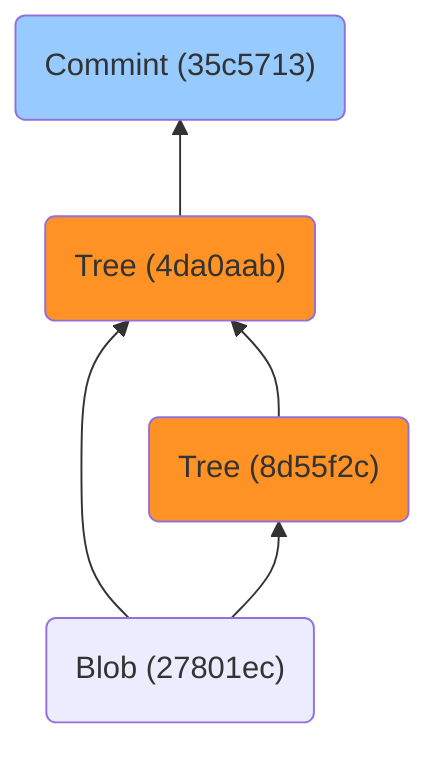
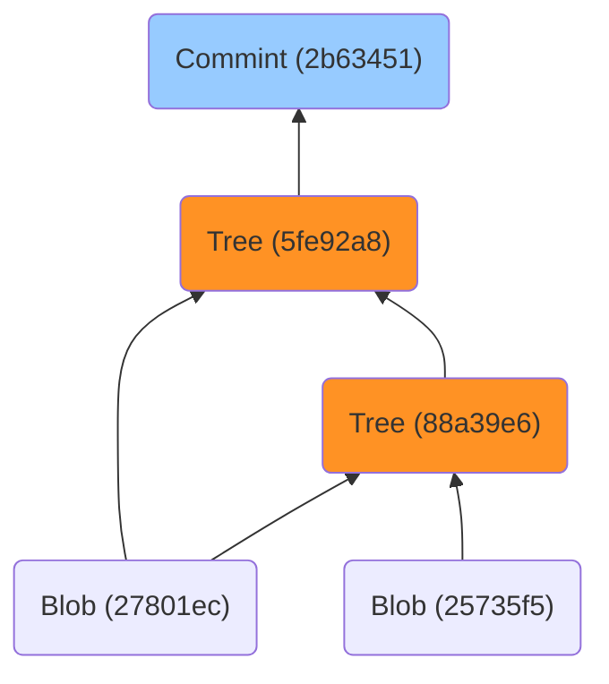
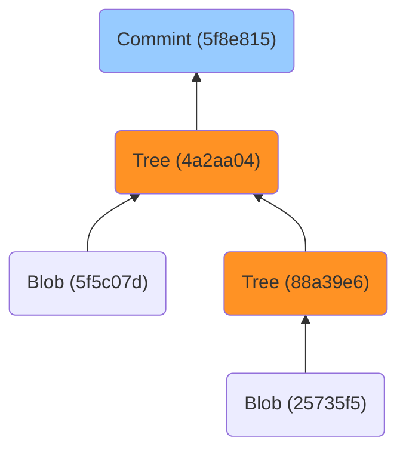

### 文件备份

假设你有备份文件的需求，那么你会如何完成该需求呢？

模拟客户提出需求、你提出方案的过程，一个简单开发流程可能如下：

- 需求：备份文件；
- 方案：采取拷贝文件的形式获取文件副本以完成备份；
- 需求：手动拷贝十分繁琐，希望能自动备份；
- 方案：添加自动备份功能；
- 需求：旧文件被直接覆盖，希望能够保存旧文件数据；
- 方案：创建二级备份目录用于存储固定时段内的所有旧文件数据，并以时间戳命名目录；
- 需求：备份目录占用空间太多；
- 方案：迭代自动备份功能，将添加二级备份压缩文件，并以时间戳命名压缩文件；
- 需求：仅本地备份缺乏安全性；
- 方案：添加额外的备份硬盘，并将所有备份数据定期自动拷贝至备份硬盘中；
- 需求：需要远程访问所有备份数据；
- 方案：将备份数据上传至云端硬盘，以供用户远程下载使用；
- ...

至此一个较为完整的、用于备份文件的工具初显雏形。

实际上，Git 大部分时间为项目所提供的也是其备份功能。虽然提及 Git 时会想到它是一款分布式的版本控制软件，但实则它于项目而言更多是一款功能强大的、用于备份文件的工具。

Git 提供了以下命令用于备份文件：

```bash
git add <file>
```

只要使用了 `git add` 命令添加文件，该文件就会以特殊对象（Blob）的形式存在于 Git 的对象数据库目录中。

普通的备份工具一般只会定时自动地备份某一时间段内的文件数据，例如间隔 24 小时执行一次备份，收集所有的文件并将它们压缩成压缩文件，并以备份开始时的具体日期、时间等信息命名该压缩文件。

于普通文件而言，也许这种备份策略无疑是优秀的。但于项目文件而言，何时备份且备份哪些文件应该由人为控制，因为解决需求的时间是无法被预估的，它可能是 3~4 天，也可能是 1 小时。

谁也不想在一天内完成了三四个版本的迭代后，但仅得到一个项目备份的情况，这显然不合理。

因此 Git 所提供的备份策略始终是人为可控的，在项目内的文件或其内容有所变动的情况下，使用以下命令可以创建一次提交：

```bash
git commit -m <message>
```

Git 的每次提交都相当于为当前项目内的文件进行一次备份，后续可以随时通过访问不同的提交，来查看不同阶段中项目所包含的文件内容，而每次提交同样会产生特殊对象（Commit、Tree）。

在节省存储空间上，大多数备份工具会采取先收集再压缩的策略：


Git 则采用先压缩再“收集”的方式：


Git “收集”已压缩的文件（Blob 对象）并不是真正的意义上地将文件集中到某个目录中存放的意思，`git commit` 命令虽说是用来保存当前项目版本的信息，但该命令实则更像是收集了当前项目所有文件的“名单”。

简单理解，Git 的每次提交都记录着当前版本中包含了哪些文件，而文件数据本身被统一存储在了 Git 的对象数据库目录中：


即便对文件的内容作出的破坏也好也会被同步存储至云端，且由于不存在其他的文件备份，目标文件将遭受不可逆的损坏。

这仅是众多文件备份形式中的一种

### 安装 Git

Git 提供多平台的支持，获取安装 Git 请参考：[Git - Downloads](https://git-scm.com/downloads)。

对于 Git 的安装过程不再赘述，因为十分简单。以下是针对 Windows 平台下的 Git 安装建议：

- Windows 平台下，安装 Git 时程序会让用户自行选择仓库默认分支名称，Git 提供了 master 和 main 两个选项，这里建议选择 main 作为默认名称。

选择 main 作为默认分支名称，将便于把仓库上传到源代码托管服务平台，例如 GitHub 或 Gitee 等。

### 基本配置

首次使用 Git 时有两个重要的配置需要提前写入配置文件中：1. 默认分支名称；2. 用户邮箱、名称。

关于 Git 的常用配置文件有三个：系统配置、全局配置和本地配置。使用 git config 命令配合不同的选项，可以查看或修改指定的 Git 配置文件：

- \--system：系统配置，该配置对所有用户生效；
- \--global：全局配置，该配置仅对当前用户生效；
- \--local：本地配置，该配置仅对当前仓库生效，且配置文件位于 .git 目录中。

不同的配置文件存在相同配置行时，配置间存在生效优先级的差别，其中：

- 本地配置 > 全局配置 > 系统配置

例如，如果本地配置和系统配置中都存在用户邮箱、名称等配置信息，但信息不同。那么在 Git 仓库进行提交时，默认使用用户邮箱、名称将为本地配置中的信息，因为本地配置优先级大于系统配置。

#### 默认分支名称

仓库上传到源代码托管服务平台时，默认分支名称是否与平台仓库的默认分支名称一致，决定了后续能否以更简洁的代码行将本地仓库代码推送至远程仓库。

而大多数的源代码托管服务平台所使用的默认分支名称为 main，因此最佳的策略是在安装 Git 时，选择 main 作为默认分支名称。

但如果在安装 Git 时忽略了默认分支名称的设置，或使用的是 Linux、Mac 等平台，那么 Git 一般直接会选择 master 作为仓库的默认分支名称。

对于已存在的 Git 仓库来说，可以通过分支重命名的方式，来修改分支名称。

例如，将分支 master 的名称更改为 main：

```bash
git branch -m master main
```

但分支重命名的前提，是 master 分支至少进行过一次提交（commit），否则重命名将失败。更为一劳永逸的方式，是将默认分支名称变更为 main。以下命令可以用于更改默认分支名称为 main：

```bash
git config --global init.defaultBranch main
```

该命令通俗易懂，即将默认的初始化分支名称命名为 main，而该配置将写入到 Global 配置文件中。

#### 用户邮箱、名称

Git 通过用户邮箱和用户名称结合的方式，来判断提交操作的用户身份。首次使用 Git 进行提交时，Git 将提示用户配置用户邮箱、名称等信息。

推荐将用户邮箱、名称等信息写入到 Global 配置文件中：

```bash
git config --global user.email "2phangx.dylan@gmail.com"
git config --global user.name "dylan127c"
```

后续的提交操作，均会以用户邮箱和名称来识别操作者的身份。

注意，合作项目中不推荐将配置写入到 Local 配置中，之前提及到 Local 配置文件位于 Git 仓库的 .git 目录，该目录显然会随着 Git 仓库一起移动。

如果将用户邮箱、名称等私人信息写入 Local 配置，当 Git 仓库被其他成员克隆或拉取时，该私人信息将会随仓库一同移动，这样会导致其他成员提交时出现用户身份紊乱的情况。

### 获取仓库

只有两种获取 Git 仓库的方法：

1. 将尚未纳入版本控制的本地目录转换为 Git 仓库；
2. 从其他远程服务器中克隆一个已存在的 Git 仓库。

#### 初始化仓库

如果有一个尚未进行版本控制的目录想要用 Git 来管理它，那首先需要进入该项目的目录中，使用以下命令将其转换为 Git 仓库：

```bash
git init
```

该命令将创建一个名为. git 的子目录。该目录含有初始化 Git 仓库中所有必须文件，它们是 Git 仓库的骨干文件。

以下命令可以指定初始化为 Git 仓库的目录名称：

```bash
git init my-repo
```

该命令会在当前目录中创建 my-repo 目录，并将其纳入版本控制中。

#### 克隆远程仓库

Git 中的克隆命令支持从远程仓库获取指定的 Git 仓库，一般它支持两种传输协议：

1. HTTP 协议
2. SSH 协议


Git 中的主要对象有三个：

- Blob Object
- Tree Object
- Commit Object

可以根据文件的 SHA-1 校验和来查询具体的对象：

```bash
git cat-file -t <object>
```

文件的 SHA-1 校验和中的前 2 位会作为目录名称，后 48 为会作为对象的存储文件。

所有对象存在于 .git/objects 目录中。

以下命令用于打印所有 .git/objects 目录下的文件：

```bash
find .git/objects -type f
```

尝试新建一个 Git 仓库，并添加一个文件和一个目录，添加并提交到 Git 仓库中：

```bash
git init test
echo "hey." > some.txt && mkdir directory_wow && cd directory_wow && echo "hey." > inside.txt && cd ..
git add . && git commit -m 'init'
```

之后查看 .git/objects 目录下的文件：

```
.git/objects/27/801ecbb255da82d48be33ab0e35f966b2c4d71
.git/objects/35/c5713378ac264f264c5640ce8eb19c06124d9a
.git/objects/4d/a0aabb85dd7df4a491ba576a6fcbda04308cb0
.git/objects/8d/55f2c8fa3341f686302621d3f2261125cc3449
```

以下命令查询 commit 记录：

```bash
git log
```

终端会输出 Commit Object 的校验和：

```
commit 35c5713378ac264f264c5640ce8eb19c06124d9a (HEAD -> main)
```

查看该对象中包含的其他对象：

```
git cat-file -p 35c5713378ac264f264c5640ce8eb19c06124d9a
```

终端输出：

```
tree 4da0aabb85dd7df4a491ba576a6fcbda04308cb0
author dylan127c <2phangx.dylan@gmail.com> 1684270160 +0800
committer dylan127c <2phangx.dylan@gmail.com> 1684270160 +0800
```

可以看到 Commit 对象中包含了 Tree 对象。继续查询 Tree 对象中的内容：

```bash
git cat-file -p 4da0aabb85dd7df4a491ba576a6fcbda04308cb0
```

终端输出：

```
040000 tree 8d55f2c8fa3341f686302621d3f2261125cc3449    directory_wow
100644 blob 27801ecbb255da82d48be33ab0e35f966b2c4d71    some.txt
```

会发现它包含了一个 Tree 对象和一个 Blob 对象。继续查询 Tree 对象中的内容：

```bash
git cat-file -p 8d55f2c8fa3341f686302621d3f2261125cc3449
```

终端输出：

```
100644 blob 27801ecbb255da82d48be33ab0e35f966b2c4d71    inside.txt
```

结构如下：



如果在 directory_wow 中写入一个内容为“hello.”的 new.file 文件，添加并提交后，该此提交的结构：



新增内容为“wow”的 123.txt 文件，并删除 some.txt 文件：



结论：

- 如果不刻意回溯版本或删除提交，那么所有 Commit、Tree、Blob 对象都永久存在；
- 每次提交发生，顶层必然会有一个新的 Commit 对象和 Tree 对象；
- 目录即为内部的 Tree 对象，如果目录内容改变，则 Tree 对象也会改变；否则不变。

另一个结论：git add 的时候会创建所有 Blob 对象，但不会创建 Tree 对象，所有的 Tree 对象在提交的一刻才会创建，顶层的 Commit 和 Tree 对象亦是如此。


添加到暂存区的 Blob 对象，即便 reset 后，Blob 对象也会一直存在。便于恢复，参考：https://blog.csdn.net/qq_56098414/article/details/121291539。

<u>那 "git restore --staged \<file>... 会删除 Blob 吗？？？</u>


