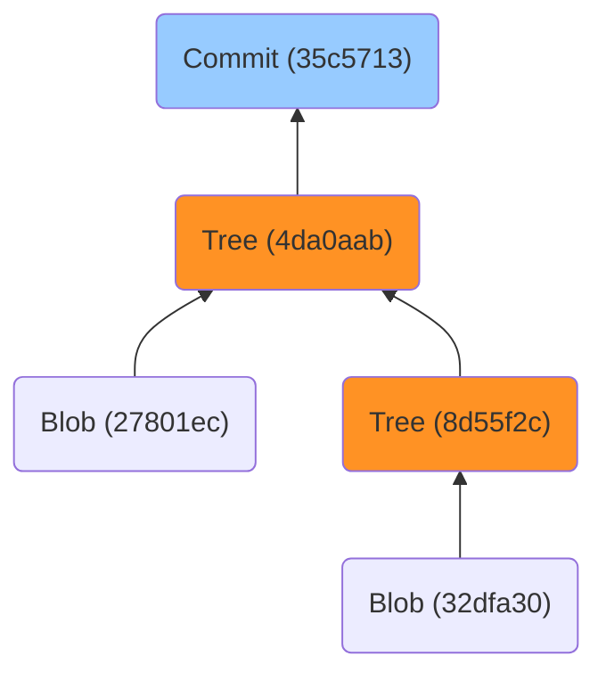

### 概述

本篇用于解析 git reset 命令。

### 重点提示

所有添加到暂存区的文件，其文件内容都会以 Blob 对象的形式永久存在。（不理解也没关系）

```bash
git add <file>…
```

每个文件通过以上命令添加到暂存区后，都会在 .git/objects 目录下，生成一个用于存放 Blob 对象的目录，该目录中存放着对应的 Blog 对象文件，它记录着对应文件的文件内容。

该目录以目标文件内容的 SHA-1 校验和前 2 位字符作为名称。进入目录后，可以看到以目标文件内容的 SHA-1 校验和后 38 位字符命名的 Blob 对象文件。

所谓永久存在，意味着文件一经添加到暂存区后，即便使用以下命令取消暂存：

```bash
git rm --cached <file>...
```

亦或是将文件直接从工作区中删除：

```bash
rm -f <file>...
```

目标文件内容所对应的 Blob 对象也不会被删除，它将永久存储在 .git/objects 目录中。

这实际只意味着文件内容与该 Blob 对象存储内容一致的信息，得以保留。

Blob 对象本质上只是根据文件内容来计算对应的 SHA-1 校验和，它常用于存储内容。当不同名文件拥有相同内容时，通过内容计算得到的 SHA-1 校验和也会相同，因此它们会指向同一个 Blob 对象。

如果已添加到暂存区的文件内容，后续进行了修改，那么 Git 也仅是会将该文件指向一个新的 Blob 对象，如无特殊情况，原本旧的 Blob 对象会被永久存储在 .git/objects 目录中。

所谓版本回溯，不过是将指定版本中的文件恢复，并将其指向原本旧的 Blob 对象。多数情况下版本回溯不会破坏工作区的文件，因此对已跟踪文件的修改记录也能够得以保留。

### 其他知识（选读）

特殊地，目录在 Git 中不会被视为文件。如果目录中存在文件，则该目录在 Git 中会被存储为一个特殊的 Tree 对象。其次，每次提交时 Git 都将提交的内容存储为一个特殊的 Commit 对象。

Tree 对象用于存储文件名称、文件类型、文件权限或文件修改时间等信息；Commit 对象则用于记录版本信息等。

从合理逻辑上来说，Git 仓库的根目录下会存在一些文件，这些文件显然不被包含在任何目录中，那么 Git 显然需要 Tree 对象来存储这些文件的必要信息。

那么理论上，每次提交发生时，如果 Git 仓库的根目录中存在已跟踪文件，则 Git 总是需要先创建一个 Tree 对象用于存储这些文件的信息，之后再使用 Commit 对象来存储提交记录。

但实际上，Git 的设计逻辑是无论根目录下是否存在文件，提交发生时总是会自动创建一个 Tree 对象，无论该对象是否需要用来存储文件信息。

大致结构如下：



其中 SHA-1 校验和为 4da0aab 的 Tree 对象，就是 Git 为记录根目录文件信息所自动创建的。

不难注意到 Commit 对象和 Tree 对象都具有 SHA-1 校验和，根据 SHA-1 校验和的计算规则，只有内容改变时校验和才会改变。

这意味着 Commit 对象的校验和必然会随着提交操作而改变，而 Tree 对象的校验和则会根据当前目录中的已跟踪文件是否有所变化，或是否新增其他已跟踪文件来判断是否需要改变。

例如，根目录对应的 Tree 对象目前的校验和为 4da0aab，该 Tree 对象随提交而自动生成。

提交一般意味着版本内容有所改变，即根目录内的某些文件必然发生了改变。因此根目录对应的 Tree 对象，其校验和必然也会随着提交而改变。

但校验和为 8d55f2c 的 Tree 对象，其对应的是普通目录，如果该目录中的已跟踪文件没有任何改变，且无新增其他的已跟踪文件，那么这个 Tree 对象的校验和就不会改变。 

### 版本回溯

注意，版本回溯只关心当前版本与目标回溯版本之间的文件差异。例如，在这两个版本之间，某个文件在某个中间版本被创建了，而后又在某个中间版本里被删除了，该文件并不会随着版本回溯而被恢复。

如果只希望恢复某个被删除的文件，建议复制仓库后，在该仓库中执行回溯版本操作，将版本回溯至该文件被删除之前的那个版本。

Git 使用 reset 命令进行版本回溯，有三种常用模式：1. mixed；2. soft；3. hard。

以上三种模式的释义如下：

- \--mixed：默认选项，用于重置暂存区，但不重置工作区。简单来说，该选项会保留当前对已跟踪文件作出的修改，但不将它们添加到暂存区中。
- \--soft：类似于 \--mixed 选项，但不同的是所有修改都会被自动添加到暂存区；
- \--hard：近乎完全的版本回溯，所有回溯版本之后新跟踪的文件都会被丢弃。但需要注意，以 .gitignore 形式忽略的文件会被标记为“未跟踪”状态。

### 常用模式

本节以图例的方式讲解以上三种常用模式。假设存在一个 Git 仓库，该仓库结构如下：


接下来会分别使用 \--mixed、\--soft 和 \--hard 将当前版本回溯至 0ccc8e5 版本。

#### Mixed

上述示例执行 \--mixed 选项的回溯版本命令：

```bash
git reset --mixed 0ccc8e5
```

回溯后的版本状态，将如下图所示：


可以简单地将 \--mixed 模式想象成复制粘贴：它会将当前版本的信息全数复制到剪切板中，在版本原原本本地回溯至目标版本后，再将剪切板的内容粘贴并覆盖其中。

因此 \--mixed 模式最直观的体现为：

- 已跟踪文件的修改记录会被保留下来：所有自回溯版本之后才进行修改的文件，都不会丢失修改记录，这些文件会在版本回溯后被视为 modified 文件；
- 已跟踪文件的追踪记录会丢失：所有自回溯版本之后才进行跟踪的文件，都会丢失跟踪记录，这些文件会在版本回溯后被视为 untracked 文件；
- 已跟踪文件的删除记录会丢失：所有自回溯版本之后才进行删除的文件，都会被直接恢复，这些文件会在版本回溯后被视为 unmodifed 文件。

特殊说明：\--mixed 模式不会对 .gitignore 产生影响。

由于 \--mixed 模式不会主动删除工作区中的文件，因此 .gitignore 文件中所映射的所有 untracked 文件都不会被影响，.gitignore 文件本身也只会是 modified、untracked 或 unmodified 中的一种。

#### Soft

上述示例执行 \--soft 选项的回溯版本命令：

```bash
git reset --soft 0ccc8e5
```

回溯后的版本状态，将如下图所示：


实际上不难看出，以 \--soft 模式回溯版本时，它仅是在以 \--mixed 模式回溯版本的基础上，执行了将所有文件添加至暂存区的操作。

可以将以下命令：

```bash
git reset --soft 0ccc8e5
```

视为以下命令的结合：

```bash
git reset --mixed 0ccc8e5 && git add .
```

显然，\--soft 模式也不会影响 .gitignore 文件的工作流程。

#### Hard

上述示例执行 \--hard 选项的回溯版本命令：

```bash
git reset --hard 0ccc8e5
```

回溯后的版本状态，将如下图所示：


可以看到工作区目录是 clean 状态，同时工作区目录中仅存 12.txt 文件。

显然 \--hard 模式是其中最严格的回溯版本模式：

- 已跟踪文件的修改记录会丢失：所有自回溯版本之后才进行修改的文件，都会丢失修改记录；
- 已跟踪文件的追踪记录会丢失且文件会被清理：所有自回溯版本之后才进行跟踪的文件，都会丢失跟踪记录，且这些文件会在版本回溯后从工作区中抹除。
- 已跟踪文件的删除记录会丢失：所有自回溯版本之后才进行删除的文件，都会被直接恢复，这些文件会在版本回溯后被视为 unmodifed 文件。

不难推断 \--hard 模式可能会影响 .gitignore 的工作流程，如果 .gitignore 文件不是在目标回溯版本或版本之前被添加，那么该文件会在版本回溯后被直接删除。

而如果 .gitignore 文件是在目标回溯版本或版本之前被添加，但在目标回溯版本之后被修改过，那么这些修改记录统统都会丢失。

但请注意，Git 不会在 reset 使用 \--hard 模式时，删除工作区中的 untracked 文件。换言之，即便是在  .gitignore 文件遭到破坏的情况下，所有此前添加到 .gitignore 中的文件都会得到保留。

因为本质上，主动添加到 .gitignore 中的文件都属于 untracked 文件，只是这些文件不会在查询 Git 状态时被标记出来。

