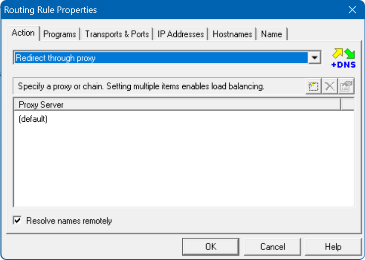
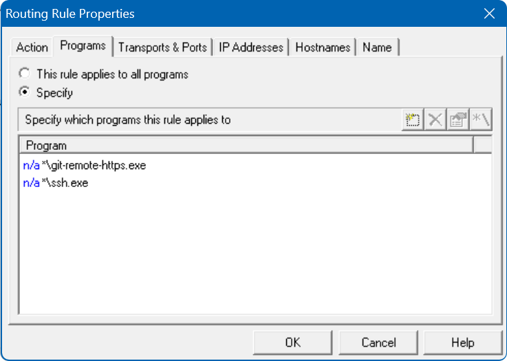
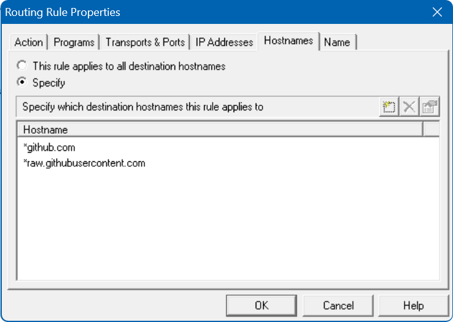

### GitHub

GitHub 是一个基于 Git 版本控制系统的代码托管平台，它提供了许多工具和服务，以帮助开发者协作、管理和追踪软件项目的变化。

### 版本环境

- Windows 11 23H2 22631.3007
- Git 2.40.0 64bit
- Clash for Windows 0.20.39 | 2023.08.17 Premium
- Clash Verge 1.3.8 | v1.16.0 Meta

### 网络问题

国内网络在连接 GitHub 时总是十分不稳定，偶尔连接顺畅，但大多数时候还是抽风比较多。本节将彻底解决 GitHub 的访问连接超时问题，但前提是拥有可用的代理服务。

### 解决方案

不借助任何额外工具的情况下，可以通过两种配置来解决连接 GitHub 时可能出现的网络问题：

1. 针对 Git 中的 HTTP(S) 请求，添加 http.proxy 配置项可解决访问 GitHub 超时的问题；
2. 针对 SSH 协议的连接请求，添加 ProxyCommand 配置可解决访问 GitHub 超时的问题。

#### 1. http.proxy

配置 HTTP(S) 协议代理：

```
git config --global http.proxy http://127.0.0.1:13766
```

除了 HTTP(S) 协议代理外，还支持使用 SOCKS5 协议：

```bash
git config --global http.proxy socks5://127.0.0.1:13766
```

两种协议实际传输的内容有所差异，其中：

- 使用 HTTP(S) 协议时，传输到代理服务的是域名请求；
- 使用 SOCKS5 协议时，传输到代理服务的是经解析后的 IP 请求。

移除代理：

```bash
git config --global --unset http.proxy
```

查看配置：

```bash
git config --global -l
```

以上代理配置将写入到 Git 的全局配置中，但这意味着无论从什么仓库地址中克隆仓库，都会使用 http.proxy 配置的代理服务。

如果希望避免所有 HTTP(S) 请求使用代理服务，还可以选择为指定域名单独配置代理： 

```bash
git config --global http.https://github.com.proxy http://127.0.0.1:13766
```

这样有且仅在发起对 GitHub 网站的 HTTP(S) 请求时，会使用代理服务。

同样，移除代理：

```bash
git config --global --unset http.https://github.com.proxy
```

#### 2. ProxyCommand

根据 Git 官方文档，http.proxy 配置项用于设置 HTTP(S) 请求的代理，而 OpenSSH 使用的 SSH 协议本与 HTTP(S) 协议无关。因此，如果需要为使用 SSH 协议推送仓库并为其设置代理，则需要使用其他的方式来配置代理服务，而不是使用 http.proxy 配置项。

确保 GitHub 中正确配置了公钥的情况下，以下命令用于测试 SSH 是否能够连接 GitHub，并会同时验证本地的私钥是否正常：

```bash
ssh -T 'git@github.com' -p 22 -i '~/.ssh/for_connect'
```

如果本地存在相关的 OpenSSH 配置：

```
Host github.com
	HostName %h
	Port 22
	IdentityFile ~/.ssh/for_connect
```

还可以选择直接使用以下命令测试 SSH 对 GitHub 的连通性：

```bash
ssh -T 'git@github.com'
```

以下提示表示 SSH 连接 GitHub 成功，且私钥通过验证：

```
Hi dylan127c! You've successfully authenticated, but GitHub does not provide shell access.
```

以下提示表示 SSH 连接 GitHub 成功，但私钥不存在或未通过验证：

```
git@github.com: Permission denied (publickey).
```

以下提示表示 SSH 连接 GitHub 超时：

```
ssh: connect to host github.com port 22: Connection timed out
```

OpenSSH 可以通过 ProxyCommand 配置，实现通过代理建立 SSH 连接，这种方式同样需要借助 connect 程序实现：

```bash
ssh -T 'git@github.com' -p 22 -i '~/.ssh/for_connect' -o 'ProxyCommand "e:/git/mingw64/bin/connect.exe" -S 127.0.0.1:13766 %h %p'
```

其中 `-o` 选项即为代理配置。

但日常的拉取或推送操作并不直接涉及到 OpenSSH 的命令，在需要拉取或推送仓库时 Git 会自发调用 OpenSSH 命令。这时候如果需要使用代理服务完成 Git Pull/Push 操作，则需要将代理信息写入 OpenSSH 的配置文件中：

```
Host github.com
	HostName %h
	Port 22
	IdentityFile ~/.ssh/for_connect
	ProxyCommand e:/git/mingw64/bin/connect -S 127.0.0.1:13766 %h %p
```

默认的 OpenSSH 配置文件 config 通常位于用户目录下的 .ssh 目录中。

配置完成后，无论是从 GitHub 拉取仓库，亦或是将仓库推送至 GitHub，建立 SSH 连接时都会使用配置中的私钥及代理配置，从而实现通过代理完成 Git Pull/Push 操作。

在添加代理服务后，如果出现以下提示，则通常意味着代理服务有问题：

```
kex_exchange_identification: Connection closed by remote host
Connection closed by UNKNOWN port 65535
```

### 完美方案

以上两种方案分别各自解决了执行 Git Clone 和 Git Pull/Push 操作访问 GitHub 网址时可能出现的网络问题，不难看出它们实际上所解决的是同一个问题，即本地访问 GitHub 网址时可能出现的网络问题。

本地无法访问 GitHub 的问题，可以通过一款代理/流量转发软件 ProxyCap 完美解决。

完成 ProxyCap 的配置前，需要知道实际用于完成 Git Clone 和 Git Pull/Push 的程序是什么，其中：

- git-remote-https.exe 程序：用于发起 Git 中克隆、拉取或推送仓库时的 HTTP(S) 请求；
- ssh.exe 程序：用于发起 Git 中克隆、拉取或推送仓库时的 SSH 请求。

了解了执行程序后，就可以在 ProxyCap 中写入配置了：







配置完成后，在 ProxyCap 启用时，所有经由程序 git-remote-https.exe 或 ssh.exe 发起的网络请求，一旦匹配 github.com 或 raw.githubusercontent.com 等域名规则，则这些网络流量则都将经由 ProxyCap 转发至目标代理服务中。

这样不仅省去了 Git 中的代理配置操作，还省去了 OpenSSH 中的代理配置操作。

### 不存在的配置项

在网络上搜索关于 Git 配置代理的相关信息时，经常能看到名为 https.proxy 配置项。这些网络回答中，几乎都是同时为 Git 配置了 http.proxy 和 https.proxy 两种属性的“代理”。

问及配置两种”代理“有什么作用时，一种通用的解释是：http.proxy 用于代理 HTTP 协议请求，https.proxy 则用于代理 HTTPS 协议请求。但实际上，属性为 https.proxy 的配置项根本就不存在，配置项 http.proxy 本身就能同时代理 HTTP 和 HTTPS 协议的请求。

根据 Git 官方文档以及其他权威资料显示，Git 没有提供 https.proxy 这样的配置项。确实只有存在 http.proxy 配置项用于设置代理，而该代理设置对 HTTP 和 HTTPS 请求均有效。
