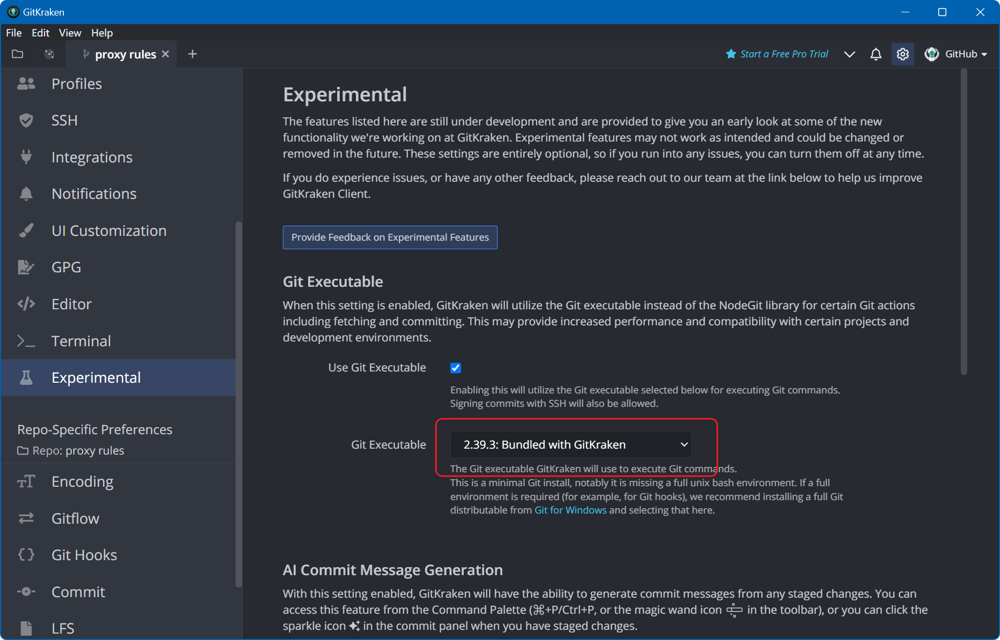
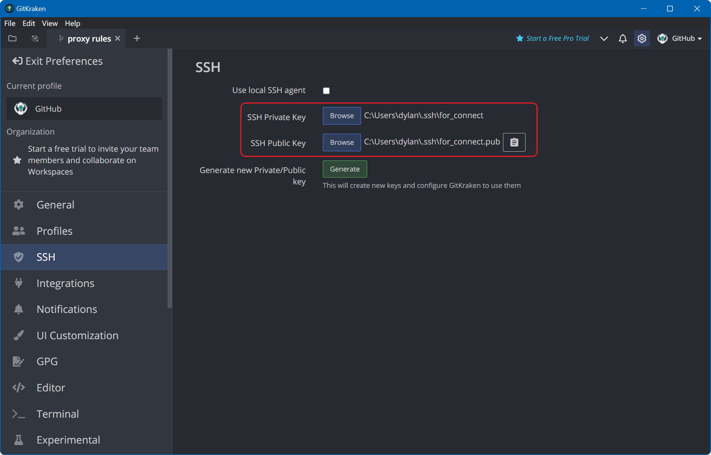
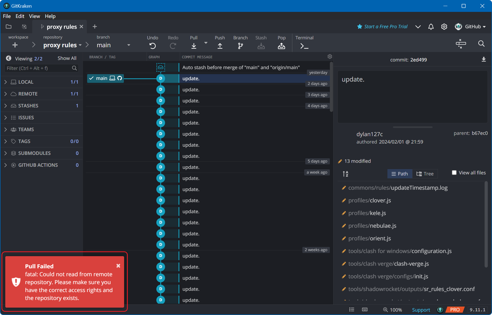
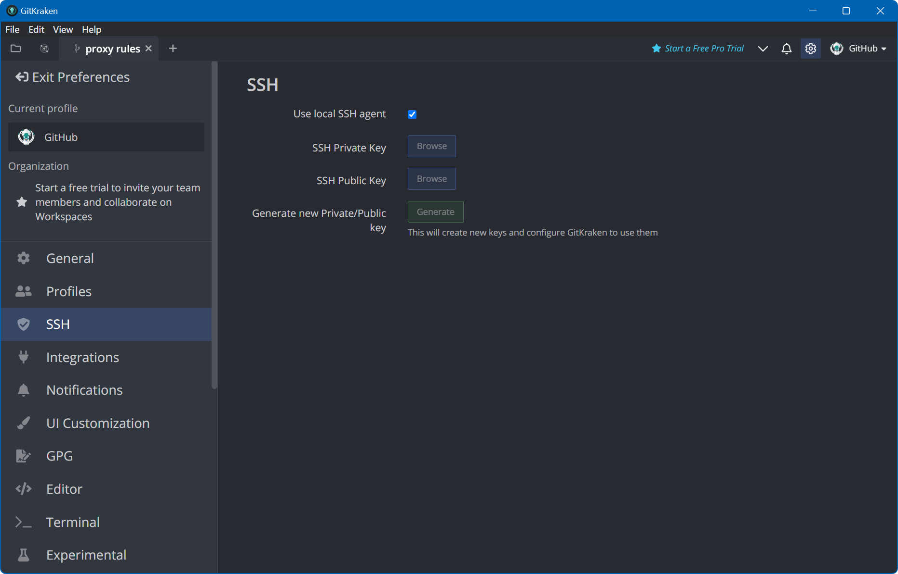
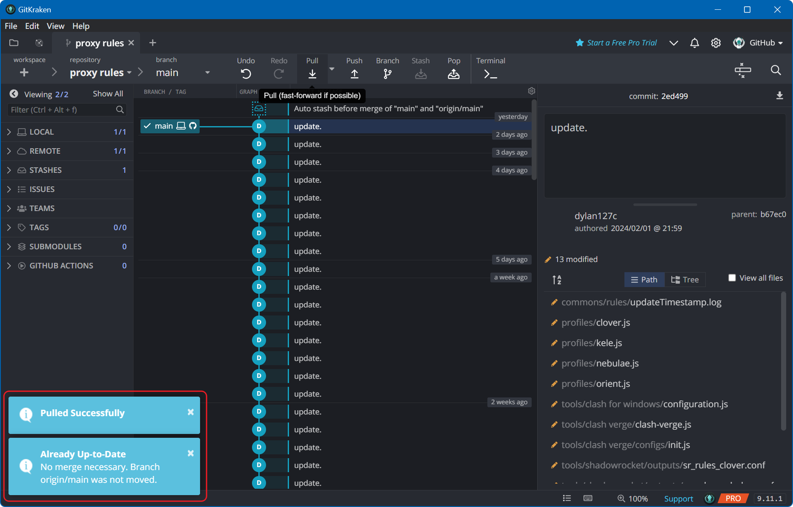
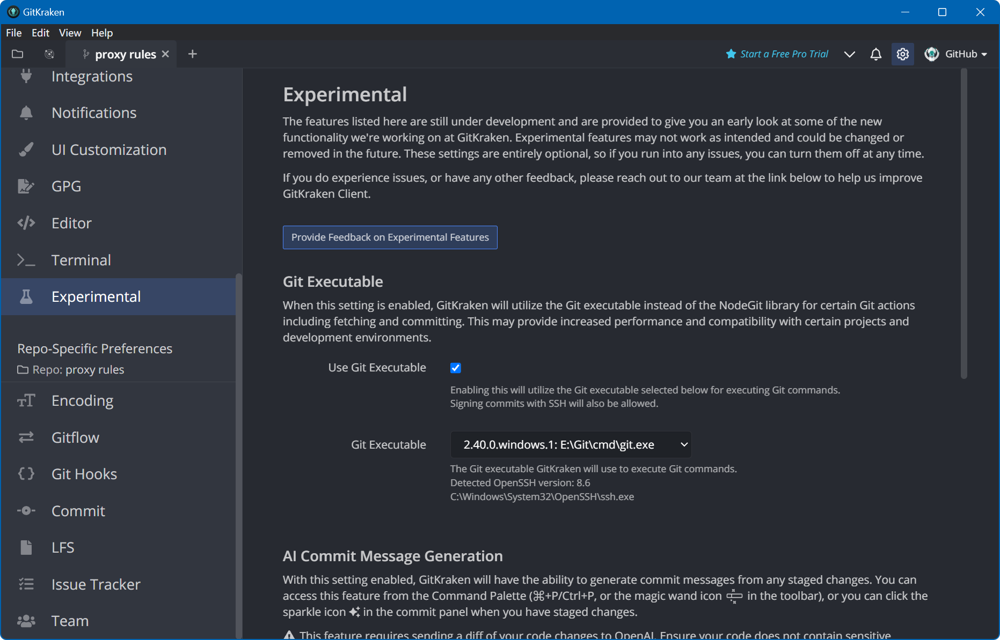
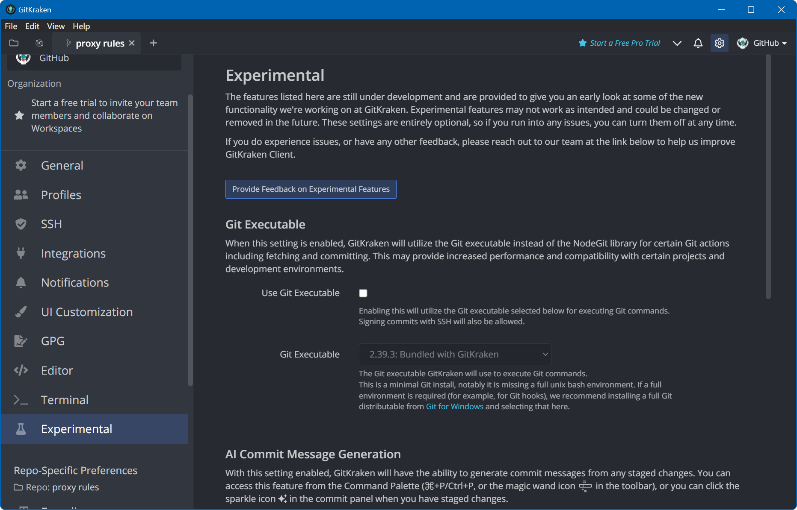

### GitKraken

GitKraken 是一款图形化的  Git  客户端，用于简化和可视化 Git 仓库的管理。它提供了用户友好的界面，使用户能够轻松地进行版本控制操作，包括提交、分支管理、合并、远程仓库同步等。

### 版本环境

- Windows 11 23H2 22631.3007
- GitKraken 9.11.1
- Git 2.40.0 64bit

### 存在问题

当前版本中，设置内会启用 Git Executalbe 实验性功能，并默认使用 GitKraken 内置的 Git 捆绑包，来作为后续执行 Git 操作时的程序。

使用该默认配置的情况下，如果自定义 SSH 私钥和公钥所在位置：

则会出现无法正常拉取或推送仓库的情况：

有且仅有选择使用本地 SSH AGENT 时，拉取或推送功能可以恢复正常：

这里建议将默认的 Git Executable 修改为本地的 Git 程序（推荐）：

或不启用实验性的 Git Executable 功能：

只要不使用 GitKraken 内置的 Git 捆绑包，正常的拉取和推送的功能就不会受到 GitKraken 内的 SSH 配置的影响。否则就只能选择在 SSH 配置中勾选使用本地的 SSH AGENT，同时舍弃自定义的 SSH 私钥和公钥。

