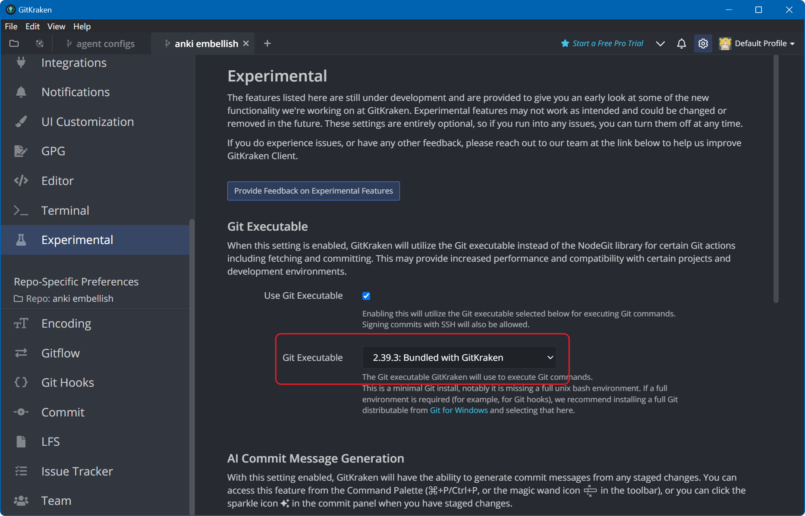
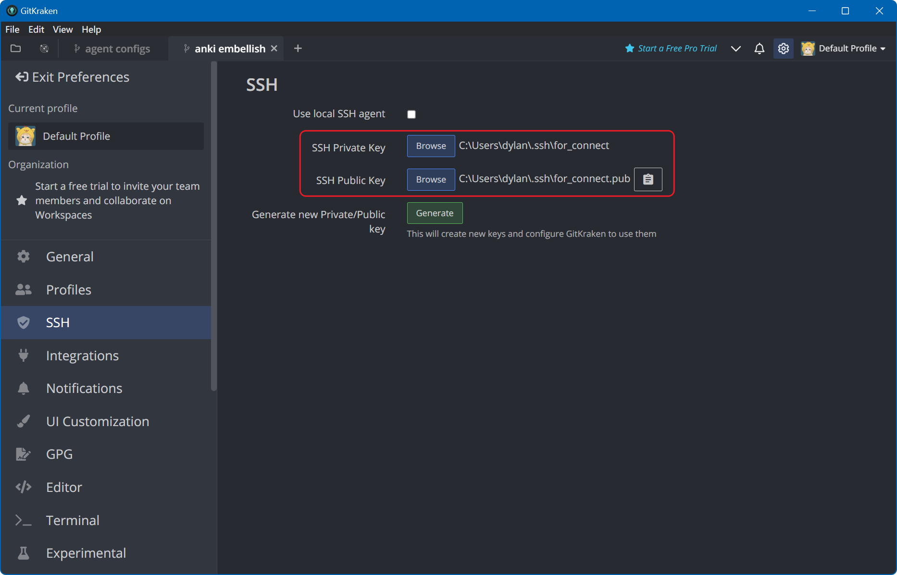
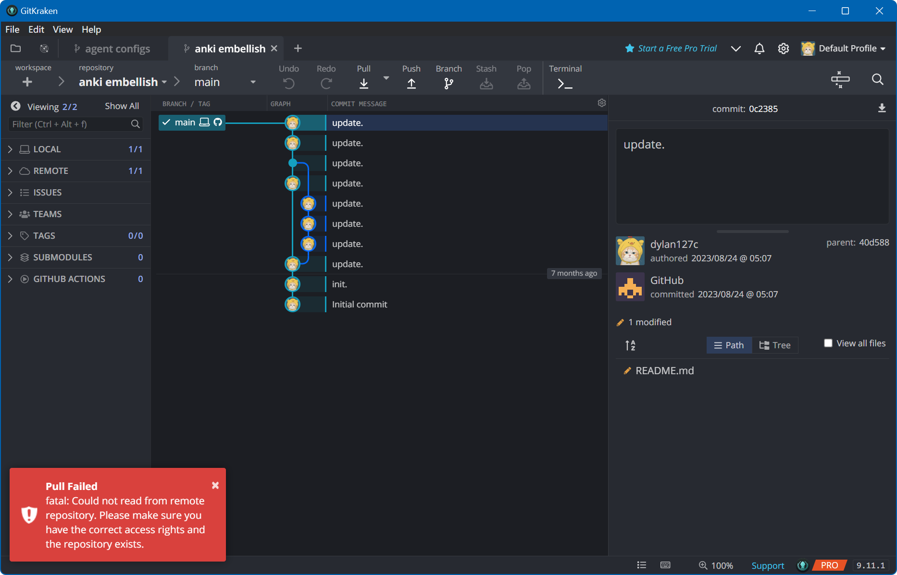
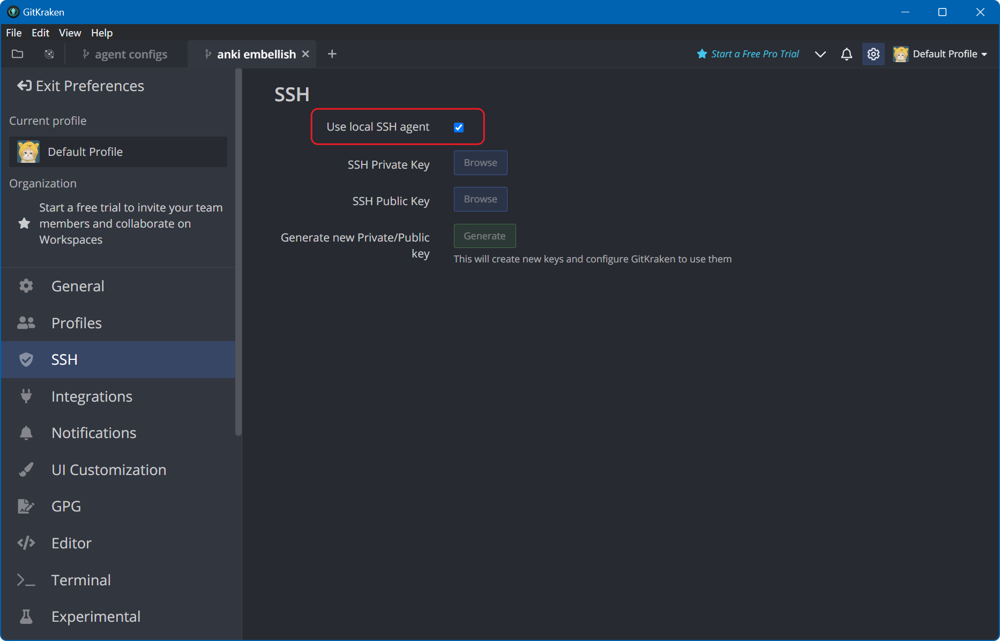
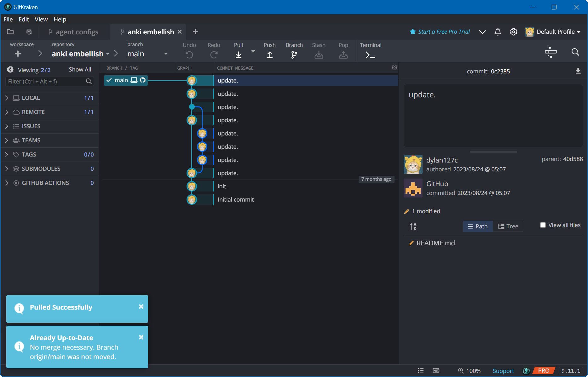
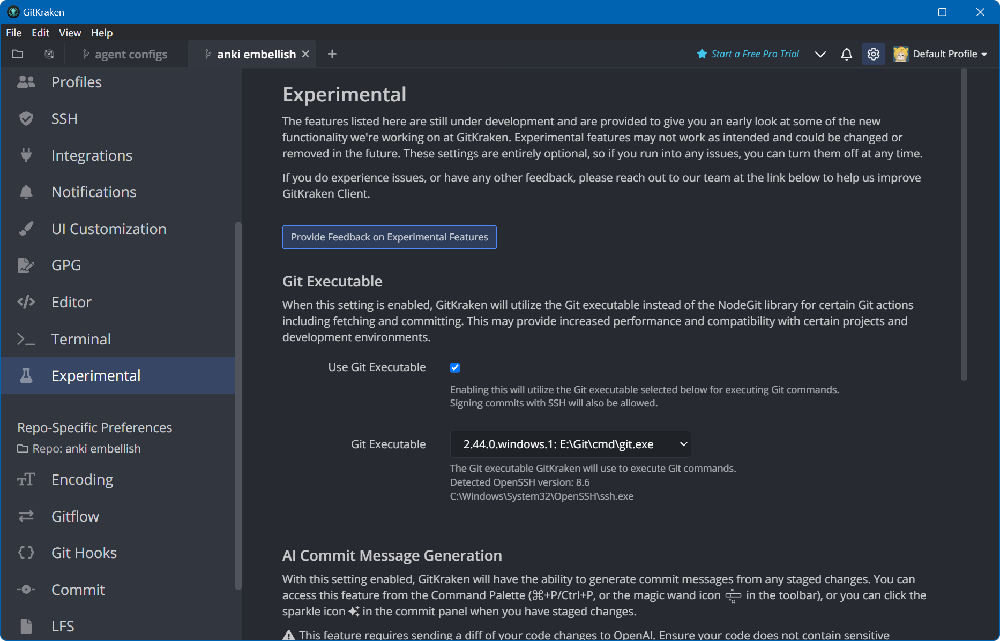
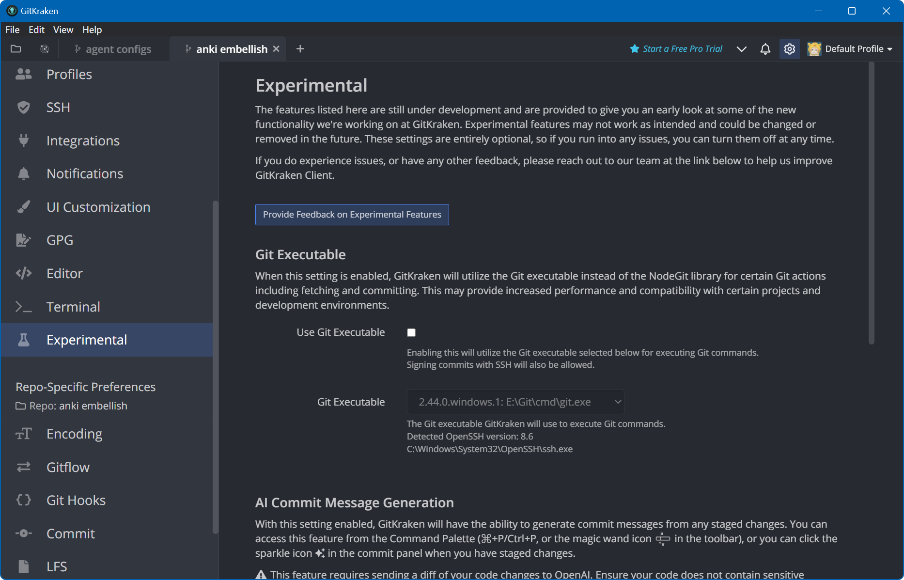

### GitKraken

GitKraken 是一款图形化的  Git  客户端，用于简化和可视化 Git 仓库的管理。它提供了用户友好的界面，使用户能够轻松地进行版本控制操作，包括提交、分支管理、合并、远程仓库同步等。

### 版本环境

- Windows 11 23H2 22631.3007
- GitKraken 9.11.1
- Git 2.44.0 64bit

### 存在问题

当前版本中，设置内会启用 Git Executalbe 实验性功能，并默认使用 GitKraken 内置的 Git 捆绑包，来作为后续执行 Git 操作的默认程序。

但该配置下，如果自定义 SSH 私钥和公钥所在位置：

则会出现无法正常拉取或推送仓库的情况：

这时有且仅有选择使用本地 SSH AGENT 时，拉取或推送功能可以恢复正常：

### 解决方法

这里推荐将默认的 Git Executable 修改为本地的 Git 程序（程序自动检测，推荐）：

或者选择不启用实验性的 Git Executable 功能：

只要不使用 GitKraken 内置的 Git 捆绑包，正常的拉取和推送的功能就不会受到 GitKraken 内的 SSH 配置的影响。
