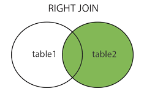

### 概述

本篇是有关 MySQL 数据库的知识点。

### 版本环境

- VMware Workstation 16 Pro（16.2.3 build-19376536）
- MySQL 8.3.0

### 数据库类型

数据库是存放数据的仓库，它是一个按数据结构来存储和管理数据的计算机软件系统。该概念实际包含两层意思：

1. 数据库是一个实体，它是能够合理保管数据的“仓库”，用户在该“仓库”中存放要管理的事务数据，“数据”和“库”两个概念组合成为数据库；
2. 数据库时数据管理的新方法和技术，它能更合适地组织数据、更方便地维护数据、更严密地控制数据和更有效地利用数据。

数据库作为最重要的基础软件，是确保计算机系统稳定运行的基石。

数据库主要有两种类型：

- 关系型数据库（Relational Database）：MySQL、SqlServer、Oracle...
- 非关系型数据库（NoSQL, Not Only SQL）：Redis、MongoDB...

关系型数据库存储的格式可以直观地反映实体间的关系。关系型数据库和常见的表格比较相似，关系型数据库中表与表之间是有很多复杂的关联关系的。

在轻量或者小型的应用中，使用不同的关系型数据库对系统的性能影响不大，但是在构建大型应用时，则需要根据应用的业务需求和性能需求，选择合适的关系型数据库。

### 存储引擎

MySQL 是否支持事务取决于其所使用的存储引擎是否支持事务。MySQL 中常用的存储引擎有两种：1. InnoDB 存储引擎；2. MyISAM 存储引擎。

MySQL 5.5 之前，一直都以 MyISAM 作为默认的存储引擎，虽然性能极佳，但该存储引擎并不支持事务；MySQL 5.6 之后，InnoDB 取代 MyISAM 作为 MySQL 的默认存储引擎。

### 版本信息

入门 MySQL 之前了解 MySQL 的版本信息至关重要，其一在于不同的 MySQL 之间查询同样的数据时，所使用的命令可能有细微差异，其二在于同一条查询命令在不同的 MySQL 版本中，得到的查询结果可能不相同。

例如，查询 MySQL 隔离级别：

```sql
SHOW VARIABLES LIKE '%ISOLATION';
```

该查询命令在某些 MySQL 版本中会得到两条查询结果：

|     Variable_Name     |      Value      |
| :-------------------: | :-------------: |
| transaction_isolation | REPEATABLE-READ |
|     tx_isolation      | REPEATABLE-READ |

而实际上，两条查询结果只会在 MySQL 5.7.20~8.0 版本中出现。

其实，无论是 transaction_isolation 还是 tx_isolation，它们实际所表示的都是当前 MySQL 的事务隔离级别。

究其原因，是 MySQL 官方从 5.7.20 版本开始，将 transaction_isolation 作为 tx_isolation 的别名引入，但考虑到兼容性暂未将 tx_isolation 废弃，直到 MySQL 8.0 版本 tx_isolation 才被废弃。

因此，如果 MySQL 版本介于 5.7.20~8.0 之间，那么以上命令会得到两条结果。由此可见，项目内如果使用了相关的 tx_isolation 结果，则使用的 MySQL 应为 8.0 版本以下，无论如何了解 MySQL 版本于项目来说大有裨益。

#### 1. 命令查询

安装 MySQL 后可以直接通过命令行的方式查询 MySQL 版本信息：

```
~]# mysql --version
mysql  Ver 8.3.0 for Linux on x86_64 (MySQL Community Server - GPL)
```

#### 2. 登录显示

使用命令行登录 MySQL 数据库时，登录成功会显示 MySQL 的版本信息：

```
~]# mysql -uroot -p
Enter password:
Welcome to the MySQL monitor.  Commands end with ; or \g.
Your MySQL connection id is 10
Server version: 8.3.0 MySQL Community Server - GPL

Copyright (c) 2000, 2024, Oracle and/or its affiliates.

Oracle is a registered trademark of Oracle Corporation and/or its
affiliates. Other names may be trademarks of their respective
owners.

Type 'help;' or '\h' for help. Type '\c' to clear the current input statement.
```

#### 3. 数据查询

进入 MySQL 后，可以查询数据库中所保存的 MySQL 版本信息，以下是常用的几种查询方法：

```
mysql> SHOW VARIABLES LIKE 'version%';
+-------------------------+------------------------------+
| Variable_name           | Value                        |
+-------------------------+------------------------------+
| version                 | 8.3.0                        |
| version_comment         | MySQL Community Server - GPL |
| version_compile_machine | x86_64                       |
| version_compile_os      | Linux                        |
| version_compile_zlib    | 1.2.13                       |
+-------------------------+------------------------------+
5 rows in set (0.00 sec)
```

```
mysql> SELECT VERSION();
+-----------+
| VERSION() |
+-----------+
| 8.3.0     |
+-----------+
1 row in set (0.01 sec)
```

```
mysql> SELECT VERSION() FROM DUAL;
+-----------+
| VERSION() |
+-----------+
| 8.3.0     |
+-----------+
1 row in set (0.00 sec)
```

### 数据库中事务的概念

数据库中事务是一组数据库操作，这些操作要么全部成功执行，要么全部失败回滚，以保持数据库的一致性和完整性。事务是数据库管理系统（DBMS）中用于确保数据一致性和可靠性的基本单位。

良好的事务**应当**具有以下四个特性，通常简称为 ACID 特性：

1. 原子性（Atomicity）：事务是原子性的，即事务中的所有操作要么全部执行成功，要么全部失败回滚。如果事务中的任何一部分操作失败，那么整个事务都会被回滚到事务开始之前的状态；
2. 一致性（Consistency）：事务执行的结果必须使数据库从一个一致性状态转移到另一个一致性状态。这意味着事务执行过程中数据库的完整性约束不会被破坏，即使在事务执行期间出现了异常情况；
3. 隔离性（Isolation）：隔离性确保并发执行的事务之间相互隔离，每个事务的操作不会受到其他事务的影响。这意味着每个事务在读取和修改数据时，都好像是在系统中独立运行的，不受其他事务的干扰；
4. 持久性（Durability）：一旦事务成功提交，其所做的修改就会永久保存在数据库中，即使系统发生故障也不会丢失。数据库系统必须确保已提交的事务对数据库的修改是持久的。

建基在事务具备 ACID 特性的前提下，银行转账操作是一个用于解释事务必要性的经典例子。

假设有一个银行系统，其中有两个账户：账户 A 和账户 B。现在，某用户要将 100 美元从账户A转账到账户 B。转账操作通常需要以下步骤：

1. 从账户 A 中扣除 100 美元；
2. 向账户 B 中添加 100 美元。

如果这两个步骤在一个事务内执行，那么无论何时发生故障，系统都能够确保数据的一致性和完整性。但如果这两个步骤分别在不同的事务中执行，那么系统可能会发生以下问题：

- 在账户 A 扣除 100 美元后、账户 B 添加 100 美元前，如果系统发生故障，那么账户 A 将损失 100 美元，而账户 B 也不会增加 100 美元，直接导致资金丢失。

显然，事务的 ACID 特性可以确保银行不会弄丢你的钱。然而，除非数据库系统通过严格的 ACID 测试，否则空谈事务的概念是不够的。

实际应用中，要完美地实现 ACID 是非常困难的，甚至可以认为是不可能或不应该的。因为兼容 ACID 的数据库系统，必须在底层作很多复杂、用户无法觉察到的工作，这虽然能确保 ACID 近乎完美的实现，但必然影响性能。

就像锁粒度的升级会增加系统开销一样，提升事务处理过程中额外的安全性，必然意味着需要数据库系统做更多的额外工作。一个实现了 ACID 的数据库，相比没有实现 ACID 的数据库，通常会需要更强的 CPU 处理能力、更大的内存和更多的磁盘空间。

换言之，数据库必须在安全性和性能之间作出必要的选择。MySQL 允许用户根据业务是否需要事务处理，选择合适的存储引擎。对于一些不需要事务的查询类应用，选择一个非事务型的存储引擎，可以获得更高的性能。

对于需要使用到事务的场景，则可以选择 MySQL 中的事务型存储引擎。MySQL 针对事务型存储引擎应具备的 ACID 特性中的隔离性（Isolation），提供了不同的事务隔离级别，用于实现不同安全等级的事务。

其中，事务隔离级别越低，则性能较高，但安全性较差；反之则安全性较高，但性能较差。因为相对来说 ACID 特性中的 ACD 特征是较容易实现的、不太影响性能的、且理应具备的，其中只有 I 特征较为复杂且影响性能。

### 事务隔离级别

MySQL 中的事务隔离级别主要针对事务的隔离性（Isolation）。事务隔离级别定义了一个事务在并发执行时与其他事务的隔离程度，决定了事务之间相互影响的程度。MySQL 提供了四种事务隔离级别：

1. READ UNCOMMITTED（读未提交）：最低级别的隔离性，允许事务读取其他事务尚未提交的数据。这种隔离级别可能导致脏读、不可重复读和幻读等并发问题；
2. READ COMMITTED（读已提交）：允许事务读取其他事务已经提交的数据，但不允许读取未提交的数据。这种隔离级别可以避免脏读，但仍然可能导致不可重复读和幻读等问题；
3. REPEATABLE READ（可重复读）：确保在同一事务内的查询中，重复读取相同数据时会返回相同的结果。这种隔离级别可以避免脏读和不可重复读，但仍可能出现幻读；
4. SERIALIZABLE（串行化）：提供最高级别的隔离性，确保事务之间的并发执行就像是串行执行一样。这种隔离级别可以避免所有并发问题，但可能会导致性能下降。

**实际上，初学事务隔离级别时往往会疑惑为什么数据库需要那么多不同隔离级别？或者说与其设计那么多的隔离级别，还不如直接将默认的事务隔离级别设计为 SERIALIZABLE 串行化，以完美实现事务的 ACID 特性。**

然而答案其实很简单，**一切都和性能相关**。不同事务隔离级别存在意义在于允许数据库系统根据不同的业务需求和性能要求，来灵活地选择适当的级别。

显然，不将默认的事务隔离级别设计为 SERIALIZABLE 串行化的原因，可以有以下几点：

1. 性能影响：SERIALIZABLE 隔离级别会将事务之间的并发执行限制为串行化，这意味着同一时间只允许一个事务执行。这种级别会导致数据库系统的性能下降，特别是在高并发环境下，因为它会增加事务之间的竞争和等待时间；
2. 并发问题的出现频率：不同的业务场景可能对并发问题的容忍程度不同。例如，在某些情况下，幻读可能并不那么重要，而在其他情况下，确保绝对的数据一致性可能是必要的。因此，选择适当的隔离级别可以根据业务需求来平衡性能和数据一致性；
3. 资源利用率：在一些情况下，所有事务都使用 SERIALIZABLE 隔离级别可能会浪费数据库系统的资源，因为并非所有事务都需要绝对的数据一致性。通过选择适当的隔离级别，可以更有效地利用数据库系统的资源。

因此，不同的事务隔离级别存在的原因是为了平衡数据库系统的性能和数据一致性，以满足不同业务场景的需求。选择合适的隔离级别可以在保证数据一致性的同时，最大程度地提高数据库系统的性能和资源利用率。

#### 1. 并发事务存在的问题

一般情况下，并发事务存在的问题仅和数据库的 DML 语句相关，即常规的“增删改查”等四种操作。

并发下，事务可能存在以下问题：

- 脏读：指一个事务读取到了另一个事务尚未提交的数据操作结果；
- 不可重复读：指事务对同一行数据的两次读取得到了不同的结果；
- 幻读：指事务在操作过程中，出现了未存在的数据或者缺少了已存在的数据。这些数据通常被称为幻影行（Phantom Row）。

#### 2. 解决并发事务的问题

不同的事务隔离级别可以解决不同的、在并发下存在的问题：

|                              | 脏读 | 不可重复读 | 幻读 |
| :--------------------------: | :--: | :--------: | :--: |
| 读未提交（READ-UNCOMMITTED） |  ❌   |     ❌      |  ❌   |
|  读已提交（READ-COMMITTED）  |  ✅   |     ❌      |  ❌   |
| 可重复读（REPEATABLE-READ）  |  ✅   |     ✅      |  ❔   |
|    串行化（SERIALIZABLE）    |  ✅   |     ✅      |  ✅   |

其中 REPEATABLE-READ 解决了部分幻读的问题。

### 事务的提交方式

在了解事务的提交方式之前，需要先知道如何修改会话（SESSION）内的事务隔离级别。

所谓会话，以 Navicat 数据库管理工具为例，一次查询时所出现的独立窗口被视为一次独立的会话：

<div align="center"></div>

#### 1. 修改事务隔离级别

MySQL 默认使用的事务隔离级别为 REPEATABLE-READ，其中提供了独立修改会话内事务隔离级别的命令：

```sql
# VARIABLES: READ UNCOMMITTED/READ COMMITTED/REPEATABLE READ/SERIALIZABLE
SET SESSION TRANSACTION ISOLATION LEVEL READ UNCOMMITTED; # CHANGE INTO READ-UNCOMMITTED
```

查看当前会话中事务隔离级别的命令为：

```sql
SHOW VARIABLES LIKE '%ISOLATION'; # ANY VERSION

SELECT @@tx_isolation; # BEFORE MySQL 8.0 VERSION
SELECT @@transaction_isolation; # AFTER MySQL 5.7.20 VERSION
```

查看全局会话中事务隔离级别的命令为：

```sql
SELECT @@global.tx_isolation; # BEFORE MySQL 8.0 VERSION
SELECT @@global.transaction_isolation; # AFTER MySQL 5.7.20 VERSION
```

修改全局事务隔离级别的命令为：

```sql
SET GLOBAL TRANSACTION ISOLATION LEVEL REPEATABLE READ; # CHANGE INTO REPEATABLE-READ
```

注意，并不推荐以全局的方式去修改 MySQL 的事务隔离级别，这有可能引发其他会话的异常。

#### 2. 自动提交

MySQL 默认使用 InnoDB 作为存储引擎，因为该引擎支持事务。通常情况下，事务是自动提交的。

- 自动提交：指事务的开始和结束都是自动完成的。

**只有将 SQL 语句的运行结果提交后，数据才会更新到数据表中，不提交则不更新。**

使用以下命令，查看事务的自动提交功能是否处于开启状态：

```sql
SHOW VARIABLES LIKE 'AUTOCOMMIT';
```

<div align="center"></div>

如果希望**临时**禁用当前会话的自动提交功能，可以通过以下命令完成：

```sql
SET autocommit = 0;
```

这将修改参数 AUTOCOMMIT 为 OFF，即表示禁用自动提交功能。

#### 3. 手动提交

禁用自动提交后，即为手动提交。手动提交时，需要使用到控制事务的命令：

1. 开启事务：BEGIN 或 START TRANSACTION，用于显式地开启一个事务；
2. 提交事务：COMMIT 或 COMMIT WORK，用于提交事务；
3. 回滚事务：ROLLBACK 或 ROLLBACK WORK，用于回滚事务。

开启事务的命令需要和提交事务或回滚事务的命令一起使用。示例：

```sql
# SESSION ONE
BEGIN;
UPDATE `user` SET age = 18 WHERE id = 1;
COMMIT;

# SESSION TWO
START TRANSACTION;
DELETE FROM `user` WHERE id = 1;
ROLLBACK WORK;
```

特殊地，某些客户端如 Navicat 中，可以不显式地开启事务，运行 SQL 后只需要执行事务的提交或回滚，即可将更新同步至数据表中。

### 并发事务问题

在事务隔离级别小节中，已经了解过并发事务下存在三个主要的问题：1. 脏读；2. 不可重复读；3. 幻读。这三个问题实际上是循序渐进地解决了并发事务下所存在的问题：

- 解决脏读问题，即需要解决的是如何让事务不读取到其他事务未提交的数据；
- 解决不可重复读问题，即需要解决的是如何让事务不读取到其他事务已提交的数据；
- 解决幻读问题，即需要解决的是如何保持事务操作过程中的一致性问题，其主要针对查询数据的一致性。

#### 1. 脏读

脏读指一个事务读取到了另一个事务尚未提交的数据操作结果。

以下为并发事务，其中 SESSION A 出现了脏读：

|              SESSION A               | RESULT |               SESSION B                | RESULT |
| :----------------------------------: | :----: | :------------------------------------: | :----: |
|               `BEGIN;`               |   OK   |                `BEGIN;`                |   OK   |
|                  -                   |   -    |  `SELECT age FROM user WHERE id = 1;`  |   18   |
|                  -                   |   -    | `UPDATE user SET age = 24 WHERE id=1;` |   OK   |
| `SELECT age FROM user WHERE id = 1;` |   24   |                   -                    |   -    |
|                  -                   |   -    |              `ROLLBACK;`               |   OK   |
| `SELECT age FROM user WHERE id = 1;` |   18   |                   -                    |   -    |
|              `COMMIT;`               |   OK   |                   -                    |   -    |

MySQL 事务隔离级别中唯一允许出现脏读现象的是读未提交（READ-UNCOMMITTED）级别。

MySQL 采用**一致性读**来解决脏读问题。**一致性读（Consistent Nonlocking Reads）**是 InnoDB 存储引擎为解决脏读、不可重复读等事务并发问题，**为事务 SELECT 查询建立的一种特殊的快照（Snapshot）机制。**

当事务隔离级别为 READ-COMMITTED 或 REPEATABLE-READ 时，一致性读功能默认开启，在这些隔离级别下的事务中执行的 SELECT 查询均为一致性读查询。一致性读启用时，事务会在查询的同时为目标表建立快照。

对于不同的事务隔离级别来说，快照建立时间点是不一样的：

- READ-COMMITTED：快照在每一次查询时都会被建立或刷新，即快照随着查询的变化而变化；
- REPEATABLE-READ：快照将在首次查询时被建立，且快照一旦建立则不会更改。

注意，一致性读本身不会在表上设置任何类型的锁，这意味着其他的会话可以自由地修改这些被一致性读的表。

#### 2. 不可重复读

不可重复读指事务对同一行数据的两次读取得到了不同的结果。

将事务隔离级别从 READ-UNCOMMITTED 提升至 READ-COMMITTED 后，一致性读将默认启用，并解决了脏读问题。不过 READ-COMMITTED 级别下的一致性读并未解决不可重复读的问题。

以下为并发事务，其中 SESSION A 出现了不可重复读：

|             SESSION A              | RESULT |              SESSION B              | RESULT |
| :--------------------------------: | :----: | :---------------------------------: | :----: |
|              `BEGIN;`              |   OK   |              `BEGIN;`               |   OK   |
| `SELECT age FROM user WHERE id=1;` |   5    |                  -                  |   -    |
|                 -                  |   -    | `UPDATE user SET age=10 WHER id=1;` |   OK   |
|                 -                  |   -    |              `COMMIT;`              |   OK   |
| `SELECT age FROM user WHERE id=1;` |   10   |                  -                  |   -    |
|             `COMMIT;`              |   OK   |                  -                  |   -    |

这是因为 READ-COMMITTED 级别下的一致性读所建立的快照在每一次查询时都会被建立或刷新，这种刷新策略虽不会刷新来自其他会话的未提交数据，但会刷新来自其他对话的已提交数据。

读取到来自其他会话的已提交数据，从而导致对同一行数据的两次读取得到不同的结果，即符合不可重复读现象。

MySQL 解决不可重复读问题的方法是采用更为严格的一致性读机制，即让快照将在首次查询时即建立，且快照一旦建立则不会更改。

#### 3. 幻读

幻读指事务在操作过程中，出现了未存在的数据或者缺少了已存在的数据，这些数据通常被称为幻影行（Phantom Row）。

将事务隔离级别从 READ-COMMITTED 提升至 REPEATABLE-READ 后，一致性读将默认启用，但该级别下的一致性读机制更加严格，它同时解决了脏读、不可重复读等并发问题。

特殊地，事务隔离级别 REPEATABLE-READ 中的一致性读机制不仅解决了脏读、不可重复读等并发问题，还顺便解决了部分并发事务中产生的幻读问题。

以下为并发事务，其中 SESSION A 出现了幻读（READ-UNCOMMITTED、READ-COMMITTED）：

|                   SESSION A                   | RESULT |                  SESSION B                   | RESULT |
| :-------------------------------------------: | :----: | :------------------------------------------: | :----: |
|                   `BEGIN;`                    |   OK   |                   `BEGIN;`                   |   OK   |
|                       -                       |   -    | `INSERT INTO human VALUES (10, 'mike', 12);` |   OK   |
| `SELECT COUNT(id) FROM human WHERE age = 12;` |   0    |                      -                       |   -    |
|                       -                       |   -    |                  `COMMIT;`                   |   OK   |
| `SELECT COUNT(id) FROM human WHERE age = 12;` |   1    |                      -                       |   -    |
|                   `COMMIT;`                   |   OK   |                      -                       |   -    |

注意，上述情况是 SESSION A 读取到了原本不存在的数据。**不要和不可重复读问题混淆，不可重复读问题针对的是同一行数据**（<u>以上幻读现象只存在于事务隔离级别为 READ-UNCOMMITTED 和 READ-COMMITTED 时</u>）。

在 REPEATABLE-READ 隔离级别下，由于更严格的一致性读机制的存在，事务会在首次查询时建立数据表的快照，并在后续不对数据表快照作出修改，因此上述幻读的问题不会在 REPEATABLE-READ 级别下出现。

处于 REPEATABLE-READ 事务隔离级别时，实际的查询情况：

|                   SESSION A                   | RESULT |                  SESSION B                   | RESULT |
| :-------------------------------------------: | :----: | :------------------------------------------: | :----: |
|                   `BEGIN;`                    |   OK   |                   `BEGIN;`                   |   OK   |
|                       -                       |   -    | `INSERT INTO human VALUES (10, 'mike', 12);` |   OK   |
| `SELECT COUNT(id) FROM human WHERE age = 12;` |   0    |                      -                       |   -    |
|                       -                       |   -    |                  `COMMIT;`                   |   OK   |
| `SELECT COUNT(id) FROM human WHERE age = 12;` |   0    |                      -                       |   -    |
|                   `COMMIT;`                   |   OK   |                      -                       |   -    |

**一致性读仅是针对事务 SELECT 查询建立的特殊的快照（Snapshot）机制，这意味着当前隔离级别下，如果仅在 SESSION A 中执行查询操作，那么数据表快照不会更新。**

**特殊地，如果在 SESSION A 中，对原本不存在、但实际已存在或原本存在、但实际不存在的这类数据行执行了增删改操作，那么这个特殊的数据表快照将会被更新！**

以下为并发事务，其中 SESSION A 出现了幻读（REPEATABLE-READ）：

|                    SESSION A                     | RESULT |                  SESSION B                   | RESULT |
| :----------------------------------------------: | :----: | :------------------------------------------: | :----: |
|                     `BEGIN;`                     |   OK   |                   `BEGIN;`                   |   OK   |
|                        -                         |   -    | `INSERT INTO human VALUES (10, 'mike', 12);` |   OK   |
|  `SELECT COUNT(id) FROM human WHERE age = 12;`   |   0    |                      -                       |   -    |
|                        -                         |   -    |                  `COMMIT;`                   |   OK   |
|  `SELECT COUNT(id) FROM human WHERE age = 12;`   |   0    |                      -                       |   -    |
| `UPDATE human SET name = 'rose' WHERE age = 12;` |   OK   |                      -                       |   -    |
|  `SELECT COUNT(id) FROM human WHERE age = 12;`   |   1    |                      -                       |   -    |
|     `SELECT name FROM human WHERE age = 12;`     |  rose  |                      -                       |   -    |
|                   `ROLLBACK;`                    |   OK   |                      -                       |   -    |

一般来说，对实际不存在的数据行执行更新操作时，操作不会成功也不会报错，运行结果将为：

```
Affected rows: 0
```

但上述会话中 SESSION A 是对原本不存在、但实际存在的数据行执行了更新操作，运行结果将为：

```
Affected rows: 1
```

这个成功的更新操作也同时导致了数据表快照的刷新，因此后续使用同样条件查询目标行的数量数据时，会返回不一样的结果，即出现了幻读现象（SESSION A 读取到了原本不存在的数据）。

事务隔离级别 REPEATABLE-READ 得益于更严格的一致性读机制，在避免脏读和不可重复读等并发问题出现的同时，还避免了部分因查询（SELECT）而产生的幻读问题。

但 REPEATABLE-READ 本身并未完全解决幻读问题，如果希望完全解决并发事务下的幻读问题，则只能选择将事务隔离级别提升至最高的 SERIALIZABLE 级别。

串行化（SERIALIZABLE）提供最严格的事务隔离模式，该模式下事务必须串行化地执行。串行化执行指的是事务只能一个接着一个地执行，不能并发执行（交错着同时执行）。

### 一致性读

一致性读（Consistent Nonlocking Reads）是 InnoDB 存储引擎为解决“脏读”、“不可重复读”等事务并发问题，而为事务内显式幻读的 SELECT 查询建立的一种特殊的快照（Snapshot）机制。

快照中不会包含未提交数据，显然该机制仅服务于 READ-COMMITTED、REPEATABLE-READ。

事务隔离级别为 READ-COMMITTED 或 REPEATABLE-READ 时，一致性读功能默认开启，在这些隔离级别下的事务中执行的显式幻读 SELECT 查询均为一致性读。

一致性读启用时，事务会在查询的同时为目标表建立快照。对于不同的事务隔离级别来说，快照建立时间点是不一样的：

- READ-COMMITTED：快照在每一次查询时都会被建立或刷新，即快照随着查询的变化而变化；
- REPEATABLE-READ：快照将在首次查询时被建立，且快照一旦建立则不会更改。

注意，一致性读本身不会在表上设置任何类型的锁，这意味着其他的会话可以自由地修改这些被一致性读的表。

当事务隔离级别为 READ-COMMITTED 时，一致性读可以保证事务内的每次查询都能获取到目标行的最新数据，从而避免了“脏读”，同时保留“不可重复读”；当事务隔离级别为 REPEATABLE-READ 时，一致性读可以保证事务内的每次查询都能获取到与首次查询相同的数据，从而避免了“脏读”和“不可重复读”。

同时，由于一致性读机制的存在，REPEATABLE-READ（可重复读）事务隔离级别下，事务能避免部分“幻读”现象的出现。对于该事务级别下已经进行过的查询，无论其他事务如何对相关行进行 INSERT、DELETE 操作，均不会影响其下一次的查询结果。

### 锁定读

锁定读（Locking Read）可以在事务中获取到目标行的最新数据。

锁定读与 InnoDB 存储引擎中提供的两种行级锁有着密切的关系，它们分别是：

- 共享锁：S LOCK (Share Lock)
- 排他锁：X LOCK (Exclusive Lock)

现阶段只需要知道共享锁 S LOCK 可以被多个事务同时持有，排他锁 X LOCK 有且只能被一个事务持有。

锁定读只有两种使用方式，它们分别用于获取目标行的共享锁和排他锁。

- 获取目标行的共享锁：

```sql
SELECT ... LOCK IN SHARE MODE # Obtaining S LOCK
```

- 获取目标行的排他锁：

```sql
SELECT ... FOR UPDATE # Obtaining X LOCK
```

MySQL 中默认存储引擎 InnoDB 默认启用的是 REPEATABLE-READ 事务隔离级别，该级别下存在一致性读，即事务内在进查询的情况下，相同 SELECT 语句所查询得到的结果总是相同的。

但实际业务中，可能需要获取最新的目标行数据，那么可以使用锁定读。事务隔离级别为 REPEATABLE-READ 时，锁定读在代码层面上的表述如下：

|                      TRANSACTION A                      | RESULT |             TRANSACTION B              | RESULT |
| :-----------------------------------------------------: | :----: | :------------------------------------: | :----: |
|                        `BEGIN;`                         |   OK   |                `BEGIN;`                |   OK   |
|          `SELECT age FROM user WHERE id = 1;`           |   12   |                   -                    |   -    |
|                            -                            |   -    | `UPDATE user SET age = 18 WHERE id=1;` |   OK   |
|                            -                            |   -    |               `COMMIT;`                |   -    |
| `SELECT age FROM user WHERE id = 1 LOCK IN SHARE MODE;` |   18   |                   -                    |   OK   |
|          `SELECT age FROM user WHERE id = 1;`           |   12   |                   -                    |   -    |
|                        `COMMIT;`                        |   OK   |                   -                    |   -    |

从技术上来说，事务隔离级别 READ-UNCOMMITTED 和 SERIALIZABLE 不需要锁定读。前者允许“脏读”，事务甚至可以获悉其他事务未提交的修改；后者的事务完全串行执行，一个事务执行时根本不运行存在其他的并行事务。

于事务隔离级别 READ-COMMITTED 而言，锁定读的查询结果和一致性读没有任何区别，它们之间只有内部执行原理有所不同：

- 锁定读需要获取目标数据行的锁；
- 一致性读不需要获取目标数据行的锁，同时它仅依赖于一致性读自动生成的数据表快照。

无疑锁定读本质上最适配的是 REPEATABLE-READ 事务隔离级别，该级别下普通 SELECT 查询无法获取到目标数据行最新版本的数据，使用锁定读即可解决该问题，这相当于把是否查询最新数据的决定权掌握在自己手中。

### 数据类型

MySQL 中常用的几种基本数据类型：1. 数值类型；2. 字符串类型；3. 日期/时间类型。

#### 1. 数值类型

MySQL 支持的数值类型：

|    type     | size (bytes) |         format         |
| :---------: | :----------: | :--------------------: |
|   TINYINT   |      1       |      TINYINT[(N)]      |
|  SMALLINT   |      2       |     SMALLINT[(N)]      |
|  MEDIUMINT  |      3       |     MEDIUMINT[(N)]     |
| INT/INTEGER |      4       |    INT/INTEGER[(N)]    |
|   BIGINT    |      8       |      BIGINT[(N)]       |
|    FLOAT    |      4       |  FLOAT(p), 0 ≤ p ≤ 23  |
|   DOUBLE    |      8       | DOUBLE(p), 24 ≤ p ≤ 53 |
|   DECIMAL   |      -       |     DECIMAL(M, D)      |

MySQL 8.0.17 版本后不推荐使用 `[(N)]` 和 `ZEROFILL` 属性，其中 `[(N)]` 表示显示长度（或显示宽度），它与数值类型本身的存储大小并无关系。

创建 `numeric_test` 数据表并借用 `ZEROFILL` 属性来完全显示 INT 类型数据内容：

```mysql
CREATE TABLE numeric_test (
	id INT(3) ZEROFILL
) ENGINE=InnoDB DEFAULT CHARSET=utf8mb4;

INSERT INTO numeric_test (id)
VALUES (1), (11), (111), (1111);
```

查询数据：

```
mysql> SELECT * FROM numeric_test;
+------+
| id   |
+------+
|  001 |
|  011 |
|  111 |
| 1111 |
+------+
4 rows in set (0.00 sec)
```

可以看到 INT 类型的**完全显示长度**为 3 字符长度，但其**存储大小**实际并未受影响（仍为 4 字节大小）。这实际意味着 `[(N)]` 属性在存储大小这方面并不重要，类似于 INT(3) 和 INT(11) 类型之间基本没有太大的实质性差别。

**自 MySQL 8.0.17 版本后，官方将 `[(N)]` 属性标记为了 `deprecated` 过时属性，并可能在未来移除。**

扩展一点，INT 类型大小为 4 字节（bytes），考虑正负数的情况下，它能够表示 `-2^31 ~ -2^31-1` 之间的所有整数类型。具体范围：

- `-2147483648 ~ 2147483647`

这意味着在包括正负符号的情况下，INT 类型最大显示长度为 11 位。在推荐为 INT 类型提供 `[(N)]` 属性的年代，该属性的实际取值范围为：

- `INT(1) ~ INT(11)`

MySQL 中，虽然可以使用诸如 INT(22) 或 INT(12) 之类的写法（不会报错），但严格来说这不够严谨。

**关于布尔类型，MySQL 中没有专门的 Boolean 数据类型，但可以使用 TINYINT(1) 来代表布尔类型，且 MySQL 中可以使用 Boolean 来作为 TINYINT(1) 的别名。**其中 1 表示真（True），0 表示假（False）。

但同样 `[(N)]` 属性仅表示数据的显示长度，这意味着 TINYINT 类型仍旧允许存储 -128 到 127 之间的整数，因此建议在使用 TINYINT(1) 表示布尔类型时，只填入 1 或 0 以表示 True 或 False。

#### 2. 字符串类型

常用的字符串类型有 CHAR、VARCHAR、BLOB、和 TEXT 等，较少使用的字符串类型有 BINARY、VARBINARY、ENUM 和 SET 等。

|    type    | size (bytes) |              description               |
| :--------: | :----------: | :------------------------------------: |
|    CHAR    |     255      | 固定长度的非二进制字符串（定长字符串） |
|  VARCHAR   |    65535     | 可变长度的非二进制字符串（变长字符串） |
|  TINYTEXT  |     255      |         非常小的非二进制字符串         |
|    TEXT    |    65535     |          普通的非二进制字符串          |
| MEDIUMTEXT |   16777215   |        中等大小的非二进制字符串        |
|  LONGTEXT  |  4294967295  |          很大的非二进制字符串          |
|  TINYBLOB  |     255      |     非常小的 BLOB（二进制大对象）      |
|    BLOB    |    65535     |      普通的 BLOB（二进制大对象）       |
| MEDIUMBLOB |   16777215   |    中等大小的 BLOB（二进制大对象）     |
|  LONGBLOB  |  4294967295  |      很大的 BLOB（二进制大对象）       |

其中最为常用的类型是 VARCHAR 类型，其使用格式为 VARCHAR(N)。其中 N 仅表示字符个数，例如 N 个中文或英文字符。**根据 VARCHAR 类型的存储大小及数据表所使用的字符集，可以计算得到 N 的范围。**

根据数据表使用的字符集，中文在数据表中所能占用的的最大字符数有所不同：

- 数据表使用 GBK 编码时，中文字符占用 2 个字节，则 VARCHAR 类型最多支持存储 32767 个中文字符；
- 数据表使用 UTF8 编码时，中文字符占用 3 个字节，则 VARCHAR 类型最多支持存储 21845 个中文字符。

**注意，和数值类型不同的是 VARCHAR 类型中的 `(N)` 属性是必须提供的，且该属性值影响插入到数据表中数据的字符长度。例如 VARCHAR(1) 类型列中，无法插入字符数量大于 1 的数据。**

CHAR 类型与 VARCHAR 类型的最大区别在于它总是会占用 N 个字符大小的空间，即便字符长度不足 N 个。而 VARCHAR 类型列存储的实际长度可以根据存储的数据而变化。

例如，在 CHAR(255) 类型列中存入长度为 1 的字符串时，它仍旧会占用 255 个字符长度的存储空间；但如果数据存入到 VARCAHR(255) 类型列中，则它仅会占用实际字符串长度的存储空间。

#### 3. 日期/时间类型

MySQL 中表示时间值的日期/时间类型有 DATETIME、DATE、TIMESTAMP、TIME 和 YEAR。

|   type    | size (bytes) |   display format    |
| :-------: | :----------: | :-----------------: |
|   DATE    |      3       |     yyyy-MM-dd      |
|   TIME    |      3       |      HH:mm:ss       |
|   YEAR    |      1       |     yyyy \| yy      |
| DATETIME  |      8       | yyyy-MM-dd HH:mm:ss |
| TIMESTAMP |      4       | yyyy-MM-dd HH:mm:ss |

日期/时间类型具有固定的格式，因此该类型数据没有所谓的 `(N)` 显示长度属性。

```mysql
CREATE TABLE date_time (
	my_date DATE,
	my_time TIME,
	my_year YEAR,
	my_datetime DATETIME,
	create_at_datetime DATETIME DEFAULT CURRENT_TIMESTAMP,
    create_at_timestamp TIMESTAMP DEFAULT CURRENT_TIMESTAMP
);

INSERT INTO date_time (my_date, my_time, my_year, my_datetime)
VALUES
('1992-11-24', '13:24:56', '1992', '1992-11-24 13:24:56'),
('1983-06-11', '00:32:17', '1983', '1983-06-11 00:32:17'),
('2012-01-07', '22:32:39', '2012', '2012-01-07 22:32:39');
```

关于 DATE、TIME、YEAR、DATETIME 等时间和日期类型的直接使用较为简单：

```
mysql> SELECT my_date, my_time, my_year, my_datetime FROM date_time;
+------------+----------+---------+---------------------+
| my_date    | my_time  | my_year | my_datetime         |
+------------+----------+---------+---------------------+
| 1992-11-24 | 13:24:56 |    1992 | 1992-11-24 13:24:56 |
| 1983-06-11 | 00:32:17 |    1983 | 1983-06-11 00:32:17 |
| 2012-01-07 | 22:32:39 |    2012 | 2012-01-07 22:32:39 |
+------------+----------+---------+---------------------+
3 rows in set (0.00 sec)
```

TIMESTAMP 类型与 DATETIME 类型之间不存在太大的差异，但通常 TIMESTAMP 类型会被用来自动生成时间戳。但从 MySQL 5.6.5 版本开始，DATETIME 类型也具有了和 TIMESTAMP 类型同款的自动初始化和更新功能。

其中 `DEFAULT CURRENT_TIMESTAMP` 即用于配置自动初始化功能。以上表为例，当数据插入到数据表时，MySQL 会自动将当前系统的时间戳插入到 `create_at_datetime` 和 `create_at_timestamp` 列中：

```
mysql> SELECT create_at_datetime, create_at_timestamp FROM date_time;
+---------------------+---------------------+
| create_at_datetime  | create_at_timestamp |
+---------------------+---------------------+
| 2024-04-13 03:09:17 | 2024-04-13 03:09:17 |
| 2024-04-13 03:09:17 | 2024-04-13 03:09:17 |
| 2024-04-13 03:09:17 | 2024-04-13 03:09:17 |
+---------------------+---------------------+
3 rows in set (0.00 sec)
```

不过和 DATETIME 类型有所不同的是，TIMESTAMP 类型可以根据 MySQL 中的 `time_zone` 参数自动转换时区。

例如，将系统的时区临时修改为 `UTC` 时区：

```mysql
SET time_zone = 'UTC';
```

则，相应的 TIMESTAMP 类型列的查询结果也会发生改变：

```
mysql> SELECT create_at_datetime, create_at_timestamp FROM date_time;
+---------------------+---------------------+
| create_at_datetime  | create_at_timestamp |
+---------------------+---------------------+
| 2024-04-13 03:09:17 | 2024-04-12 19:09:17 |
| 2024-04-13 03:09:17 | 2024-04-12 19:09:17 |
| 2024-04-13 03:09:17 | 2024-04-12 19:09:17 |
+---------------------+---------------------+
3 rows in set (0.00 sec)
```

如果希望记录行的更新时间，则需要在创建表时添加 `ON UPDATE CURRENT_TIMESTAMP` 用于配置自动更新功能：

```mysql
CREATE TABLE date_time (
	my_date DATE,
	my_time TIME,
	my_year YEAR,
	my_datetime DATETIME,
	update_at_datetime DATETIME DEFAULT CURRENT_TIMESTAMP ON UPDATE CURRENT_TIMESTAMP,
    update_at_timestamp TIMESTAMP DEFAULT CURRENT_TIMESTAMP ON UPDATE CURRENT_TIMESTAMP
);

INSERT INTO date_time (my_date, my_time, my_year, my_datetime)
VALUES
('1992-11-24', '13:24:56', '1992', '1992-11-24 13:24:56'),
('1983-06-11', '00:32:17', '1983', '1983-06-11 00:32:17'),
('2012-01-07', '22:32:39', '2012', '2012-01-07 22:32:39');
```

以上数据表在初始化数据时，会将时间戳作为行的更新时间，并在行更新时同步当前的时间戳为新的更新时间。

完成初始化时，查询更新列所记录的数据（使用 UTC 时区）：

```
mysql> SELECT update_at_datetime, update_at_timestamp FROM date_time;
+---------------------+---------------------+
| update_at_datetime  | update_at_timestamp |
+---------------------+---------------------+
| 2024-04-13 03:27:53 | 2024-04-12 19:27:53 |
| 2024-04-13 03:27:53 | 2024-04-12 19:27:53 |
| 2024-04-13 03:27:53 | 2024-04-12 19:27:53 |
+---------------------+---------------------+
3 rows in set (0.01 sec)
```

尝试更新第二行数据：

```mysql
UPDATE date_time
SET my_time = '01:28:19'
WHERE my_year = 1983;
```

并再次查询更新列数据（使用 UTC 时区）：

```
mysql> SELECT update_at_datetime, update_at_timestamp FROM date_time;
+---------------------+---------------------+
| update_at_datetime  | update_at_timestamp |
+---------------------+---------------------+
| 2024-04-13 03:27:53 | 2024-04-12 19:27:53 |
| 2024-04-13 03:30:03 | 2024-04-12 19:30:03 |
| 2024-04-13 03:27:53 | 2024-04-12 19:27:53 |
+---------------------+---------------------+
3 rows in set (0.00 sec)
```

虽然 DATETIME 类型同样支持自动初始化和更新功能，但仍更推荐使用 TIMESTAMP 类型来自动记录并更新时间，其主要的原因就在于 TIMESTAMP 类型能够依据**客户端的时区配置**来动态显示时间。

假如远程客户端使用的是 `Asia/Shanghai` 时区，并假设更新上述数据表中的某行数据后 `update_at_timestamp` 被记录为：

- `2024-04-13 03:30:03`（CST）

则，该时间在使用 `UTC` 时区下的远程客户端上将显示为：

- `2024-04-12 19:30:03`（UTC）

显然从协作业务角度出发，使用 TIMESTAMP 作为记录更新时间的类型是更加合理的选择，更别说 TIMESTAMP 本身就具有记录时间的意思了。

查询客户端所使用的时区：

```
mysql> SHOW VARIABLES LIKE 'time_zone%';
+---------------+--------+
| Variable_name | Value  |
+---------------+--------+
| time_zone     | SYSTEM |
+---------------+--------+
1 row in set (0.01 sec)
```

对于时区来说，一般保持默认的 `SYSTEM` 时区即可，它表示服务器时区与系统时区相同。例如将 MySQL 部署在容器中，那么容器内 MySQL 时区将与容器环境内的 Linux 系统时区一致。

如需临时配置当前客户端会话使用的时区，可以使用 `SET` 语句：

```mysql
SET time_zone = 'UTC'
```

其中 `time_zone` 的值可以是 `SYSTEM`、`UTC`、`+08:00` 或 `Asia/Shanghai` 等等，关于 `time_zone` 的更多可用值请参考 MySQL 8.3 的官方手册 [Time Zone Variables](https://dev.mysql.com/doc/refman/8.3/en/time-zone-support.html#time-zone-variables)。

扩展：使用 docker 创建容器时默认使用 UTC 时区。如果希望容器使用 CST 时区，则需要在创建容器时为容器添加指定的容器环境参数，例如 `-e TZ=Asia/Shanghai` 指定容器时区。

这样在容器创建后，容器内的系统将使用 CST 时区：

```
bash-4.4# date
Sat Apr 13 04:22:04 CST 2024
```

### 常用语句

数据库相关：

```mysql
# 查看所有数据库
SHOW DATABASES;

# 使用目标数据库
USE database_name;

# 创建目标数据库
CREATE DATABASE [IF NOT EXISTS] database_name
[CHARACTER SET charset_name]
[COLLATE collation_name];

# 删除目标数据库（如果存在）
DROP DATABASE [IF EXISTS] database_name;
```

数据表相关：

```mysql
# 查看所有数据表
SHOW TABLES;

# 创建目标数据表
CREATE TABLE table_name (
    column1 datatype,
    column2 datatype,
    ...
);

# 查看数据表结构
SHOW COLUMNS FROM table_name;

# 删除目标数据表
DROP TABLE [IF EXISTS] table_name;

# 为数据表添加列
ALTER TABLE table_name
ADD COLUMN new_column_name datatype;

# 修改数据表列的数据类型
ALTER TABLE TABLE_NAME
MODIFY COLUMN column_name new_datatype;

# 修改数据表列的名称
ALTER TABLE table_name
CHANGE COLUMN old_column_name new_column_name datatype;

# 删除数据表的列
ALTER TABLE table_name
DROP COLUMN column_name;

# 为数据表列添加主键索引
ALTER TABLE table_name
ADD PRIMARY KEY (column_name);

# 为数据表列添加外键索引
ALTER TABLE child_table
ADD CONSTRAINT fk_name
FOREIGN KEY (column_name)
REFERENCES parent_table (column_name);

# 修改数据表的名称
ALTER TABLE old_table_name
RENAME TO new_table_name;
```

例如创建 user 数据表：

```mysql
CREATE TABLE users (
    id INT AUTO_INCREMENT PRIMARY KEY,
    username VARCHAR(50) NOT NULL,
    email VARCHAR(100) NOT NULL,
    birthdate DATE,
    is_active BOOLEAN DEFAULT TRUE
);
```

### 索引类型

索引是一种数据结构，用于加快数据库查询的速度和性能。MySQL 索引的建立对于 MySQL 的高效运行是很重要的，索引可以大大提高 MySQL 的检索速度。

MySQL 中常用的索引类型有主键索引（PRIMARY KEY）、唯一索引（UNIQUE KEY）、普通索引（INDEX）和全文索引（FULLTEXT）。

- 主键索引（PRIMARY KEY）：唯一且非空的索引，用于唯一标识每一行数据。
- 唯一索引（UNIQUE KEY）：唯一但允许空值存在的索引，用于确保索引列中的值是唯一的。
- 普通索引（INDEX）：不唯一且允许重复值存在的索引，用于加快数据检索速度。
- 全文索引（FULLTEXT）：用于文本字段的索引类型，只能用于 `CHAR`、`VARCHAR `和 `TEXT` 类型的列，允许进行高级的全文搜索操作。

其中，“唯一”指的是索引列中的每个值都是唯一的，即不允许重复的数据；“非空”指的是不允许 NULL 值。

有三种不同的方式用于创建或添加索引：

1. 使用 CREATE INDEX 可以直接创建普通索引；
2. 使用 ALTER TABLE 修改表结构可以添加主键索引、唯一索引、普通索引和全文索引；
3. 使用 CREATE TABLE 创建表时，可以直接指定主键索引、唯一索引。

#### 1. 显示索引

查看数据表中的相关索引信息，可以获取到字段的索引名：

```mysql
SHOW INDEX FROM table_name;
```

查看数据表中的字段信息，可以获取到字段的索引类型信息：

```mysql
SHOW COLUMNS FROM table_name;
```

#### 2. 创建索引

CREATE INDEX 语句可以用于创建唯一索引、普通索引和全文索引：

```mysql
CREATE UNIQUE INDEX index_name ON table_name (column1 [ASC|DESC], ...);
CREATE INDEX index_name ON table_name (column1 [ASC|DESC], ...);
CREATE FULLTEXT INDEX index_name ON table_name (column1 [ASC|DESC], ...);
```

#### 3. 添加索引

ALTER TABLE 修改表结构可以添加主键索引、唯一索引、普通索引和全文索引：

```mysql
ALTER TABLE table_name ADD PRIMARY KEY (column_list);
ALTER TABLE table_name ADD UNIQUE (column_list);
ALTER TABLE table_name ADD INDEX (column_list);
ALTER TABLE table_name ADD FULLTEXT (column_list);
```

其中允许对唯一索引、普通索引和全文索引进行命名：

```mysql
ALTER TABLE table_name ADD UNIQUE index_name(column_list);
ALTER TABLE table_name ADD INDEX index_name(column_list);
ALTER TABLE table_name ADD FULLTEXT index_name(column_list);
```

#### 4. 指定索引

CREATE TABLE 创建表时，可以直接指定列的索引类型：

```mysql
CREATE TABLE users (
    id INT,
    username VARCHAR(50),
    age INT,
	email VARCHAR(100),
    PRIMARY KEY (id),
    UNIQUE (username),
    INDEX (age),
    FULLTEXT (email)
);
```

其中允许对唯一索引、普通索引和全文索引进行命名：

```mysql
CREATE TABLE users (
    id INT,
    username VARCHAR(50),
    age INT,
    email VARCHAR(100),
    PRIMARY KEY (id),
    UNIQUE unique_username(username),
    INDEX index_age(age),
    FULLTEXT fulltext_email(email)
);
```

特殊地，有且仅有主键索引和唯一索引可以在定义列时通过关键字指定：

```mysql
CREATE TABLE users (
    id INT PRIMARY KEY,
    username VARCHAR(50) UNIQUE
);
```

但使用这种方式无法对唯一索引进行索引命名。使用 CONSTRAINT 关键字可以折中做到为唯一索引命名的目的：

```mysql
CREATE TABLE users (
    id INT,
    username VARCHAR(50),
    CONSTRAINT PRIMARY KEY (id),
    CONSTRAINT unique_username UNIQUE (username)
);
```

但同样地，CONSTRAINT 关键字不支持普通索引和全文索引。

#### 5. 删除索引

一般使用 ALTER 语句删除索引，其中：

- 删除主键索引只需指定 PRIMARY KEY 关键字；
- 删除唯一索引、普通索引和全文索引，必须提供索引名。

唯一索引、普通索引和全文索引在不显式提供索引名时，默认使用列名作为索引名。

查看数据表中的相关索引信息，可以获取到字段的索引名：

```mysql
SHOW INDEX FROM table_name;
```

删除主键索引：

```mysql
ALTER TABLE table_name DROP PRIMARY KEY;
```

删除唯一索引、普通索引和全文索引：

```mysql
ALTER TABLE table_name DROP index_name;
```

### 增删改查

查询数据：

```mysql
SELECT column1, column2, ...
FROM table_name
[WHERE condition]
[ORDER BY column_name [ASC | DESC]]
[LIMIT number];
```

修改数据：

```mysql
UPDATE table_name
SET column1 = value1, column2 = value2, ...
WHERE condition;
```

增加数据：

```mysql
INSERT INTO table_name (column1, column2, column3, ...)
VALUES (value1, value2, value3, ...);
```

删除数据：

```mysql
DELETE FROM table_name
WHERE condition;
```

### 条件查询

将 WHERE 子句添加到 SELECT 语句中，可以实现有条件地从表中选取数据：

```mysql
SELECT column1, column2, ...
FROM table_name
WHERE condition;
```

WHERE 字句支持诸如等号、不等号、大于号、小于号等常见的操作符，除此之外 MySQL 还提供了其他的一些关键字操作符。

AND | OR | NOT：

```mysql
SELECT * FROM users WHERE id < 29 AND age > 21;
SELECT * FROM users WHERE id > 17 OR  age > 18;
SELECT * FROM users WHERE NOT id < 22;
```

IN：

```mysql
SELECT * FROM users WHERE age IN (22, 18, 21);
```

LIKE：

```mysql
SELECT * FROM users WHERE username LIKE 'M%';
```

BETWEEN：

```mysql
SELECT * FROM users WHERE birthday BETWEEN '2023-01-01' AND '2023-12-31';
```

IS NULL | IS NOT NULL：

```mysql
SELECT * FROM users WHERE email IS NULL;
SELECT * FROM users WHERE phone IS NOT NULL;
```

### 排序查询

将 ORDER BY 子句添加到 SELECT 语句中，可以对读取的数据进行排序：

```mysql
SELECT column1, column2, ...
FROM table_name
ORDER BY column1 [ASC | DESC [NULLS [FIRST | LAST]]], column2 [ASC | DESC[NULLS [FIRST | LAST]]], ...;
```

排序查询支持单列排序和多列排序。除此之外，排序查询还支持使用数字表示列的位置，例如：

```mysql
SELECT first_name, last_name, salary
FROM employees
ORDER BY 3 DESC, 1 ASC;
```

### 分组查询

将 GROUP BY 子句添加到 SELECT 语句中，根据一个或多个列并结合聚合函数 COUNT、SUM、AVG 等，可以实现对查询结果的分组：

```mysql
SELECT column1, column2, ..., aggregate_function(column2)
FROM table_name
WHERE condition
GROUP BY column1, column2, ...[WITH ROLLUP];
```

注意一下 WITH ROLLUP 关键字，这个关键字将在聚合函数的统计基础上，再对统计结果进行相同的统计，并在输出结果上添这些统计数据。例如：

```
mysql> SELECT name, SUM(signin) as signin_count FROM employee_tbl GROUP BY name WITH ROLLUP;
+--------+--------------+
| name   | signin_count |
+--------+--------------+
| mike   |            2 |
| rose   |            7 |
| kevin  |            7 |
| NULL   |           16 |
+--------+--------------+
4 rows in set (0.00 sec)
```

其中 `name` 为 NULL 值的行得到的 `signin_count` 即为上述所有统计数据的进一步统计结果。

使用 coalesce 函数可以为 NULL 设置一个别名：

```
mysql> SELECT coalesce(name, 'total') as name, SUM(signin) as signin_count FROM employee_tbl GROUP BY name WITH ROLLUP;
+--------+--------------+
| name   | signin_count |
+--------+--------------+
| mike   |            2 |
| rose   |            7 |
| kevin  |            7 |
| total  |           16 |
+--------+--------------+
4 rows in set (0.00 sec)
```

大概就是 coalesce 函数会为指定列中的 NULL 值赋予一个别名，以方便用户阅读数据。

### 分页查询

分页查询使用 LIMIT [... OFFSET] 子句，且一般会配合 ORDER BY 子句完成：

```mysql
SELECT column1, column2, ...
FROM table_name
ORDER BY column1 [ASC | DESC [NULLS [FIRST | LAST]]], column2 [ASC | DESC[NULLS [FIRST | LAST]]], ...
LIMIT page_size [OFFSET page_size * (page_index - 1)];
```

MySQL 中支持省略 OFFSET 子句：

```mysql
SELECT column1, column2, ...
FROM table_name
ORDER BY column1 [ASC | DESC [NULLS [FIRST | LAST]]], column2 [ASC | DESC[NULLS [FIRST | LAST]]], ...
LIMIT page_size[, page_size * (page_index - 1)];
```

其中：

- `page_size`：每页显示的行数；
- `page_index`：当前显示的页数。

LIMIT 用于现在查询结果的显示行数，而 OFFSET 偏移量则用于指示 LIMIT 需要跳过的行数。例如：

```mysql
LIMIT 10 OFFSET 0;
```

这表示最终查询结果需要跳过所有查询结果的前 0 行并只显示 10 行内容。

特殊地，如果数据表内只有 10 行数据，但分页查询子句为：

```mysql
LIMIT 10 OFFSET 20;
```

那么最终得到的查询结果将为空，不会报错。

### 联结查询

联结表是 SQL 高级查询技巧中不可忽视的一部分，业务中可能不常使用，了解即可。

SQL 可以基于表间的共同字段，把来自两个或多个表的数据结合起来，通过 JOIN 关键字实现表间的联结操作。

标准 SQL 中提供的的联结操作共有 4 个：1. 内联结（INNER JOIN）；2. 左联结（LEFT JOIN）；3. 右联结（RIGHT JOIN）；4. 全联结（FULL OUTER JOIN）。**MySQL 仅支持全联结之外的其他联结表操作。**

创建 username 和 useraddress 数据表：

```sql
CREATE TABLE username (
	id INT(10) NOT NULL AUTO_INCREMENT PRIMARY KEY,
	user_name VARCHAR(32) NOT NULL
) ENGINE=InnoDB DEFAULT CHARSET=utf8mb4;

CREATE TABLE useraddress (
	id INT(10) NOT NULL AUTO_INCREMENT PRIMARY KEY,
	user_address VARCHAR(32) NOT NULL
) ENGINE=InnoDB DEFAULT CHARSET=utf8mb4;

INSERT INTO username(id, user_name)
VALUES
	(1, "Google"),
	(2, "Taobao"),
	(3, "Weibo"),
	(4, "Facebook");
	
INSERT INTO useraddress(id, user_address)
VALUES
	(1, "America"),
	(5, "China"),
	(3, "China"),
	(6, "America");
```

#### 1. 内联结

内联结（INNER JOIN）是最常见的一种联结表操作，只要联结匹配即可。

<div align="center"></div>

内联结通过 INNER JOIN 关键字实现：

```sql
SELECT username.id as id, username.user_name as user_name, useraddress.user_address as user_address
FROM username
INNER JOIN useraddress
ON username.id = useraddress.id;
```

内联结还可以通过 WHERE 关键字实现：

```sql
SELECT username.id id, username.user_name user_name, useraddress.user_address user_address FROM username, useraddress
WHERE username.id = useraddress.id;
```

查询结果：

```
mysql> SELECT username.id as id, username.user_name as user_name, useraddress.user_address as user_address
    -> FROM username
    -> INNER JOIN useraddress
    -> ON username.id = useraddress.id;
+----+-----------+--------------+
| id | user_name | user_address |
+----+-----------+--------------+
|  1 | Google    | America      |
|  3 | Weibo     | China        |
+----+-----------+--------------+
2 rows in set (0.00 sec)
```

内联结实际上就是数据表基于联结条件的交集，其中 INNER JOIN 关键字中 INNER 可以省略不写。

#### 2. 左联结

左联结（LEFT JOIN）将返回左表的全部行和右表满足 ON 条件的行。特殊地，如果左表的行在右表中没有对应的匹配数据，那么这一行数据将使用 NULL 代替。

<div align="center"></div>

左联结通过 LEFT JOIN 关键字实现：

```sql
SELECT username.*, useraddress.user_address as user_address
FROM username
LEFT JOIN useraddress
ON username.id = useraddress.id;
```

查询结果：

```
mysql> SELECT username.*, useraddress.user_address as user_address
    -> FROM username
    -> LEFT JOIN useraddress
    -> ON username.id = useraddress.id;
+----+-----------+--------------+
| id | user_name | user_address |
+----+-----------+--------------+
|  1 | Google    | America      |
|  2 | Taobao    | NULL         |
|  3 | Weibo     | China        |
|  4 | Facebook  | NULL         |
+----+-----------+--------------+
4 rows in set (0.00 sec)
```

#### 3. 右联结

右联结（RIGHT JOIN）将返回右表的全部行和左表满足 ON 条件的行。特殊地，如果右表的行在左表中没有对应的匹配数据，那么这一行数据将使用 NULL 代替。

<div align="center"></div>

右联结通过 RIGHT JOIN 关键字实现：

```sql
SELECT useraddress.*, username.user_name as user_name
FROM username
RIGHT JOIN useraddress
ON username.id = useraddress.id;
```

查询结果：

```
mysql> SELECT useraddress.*, username.user_name as user_name
    -> FROM username
    -> RIGHT JOIN useraddress
    -> ON username.id = useraddress.id;
+----+--------------+-----------+
| id | user_address | user_name |
+----+--------------+-----------+
|  1 | America      | Google    |
|  3 | China        | Weibo     |
|  5 | China        | NULL      |
|  6 | America      | NULL      |
+----+--------------+-----------+
4 rows in set (0.00 sec)
```

#### 4. 全联结

全联结（FULL OUTER JOIN）将返回左表和右表里所有的行。如果其中一个表的数据行在另一个表中没有匹配的行，那么对应的数据将使用 NULL 代替。

<div align="center"></div>

**MySQL 中虽然不支持全联结，但仍旧可以编写一下全联结的 SQL 语句。**

假如使用以下 SQL 进行全联结：

```sql
SELECT useraddress.*, username.*
FROM username
FULL OUTER JOIN useraddress
ON username.id = useraddress.id;
```

查询结果：

```
SQL> SELECT useraddress.*, username.user_name as user_name
    -> FROM username
    -> RIGHT JOIN useraddress
    -> ON username.id = useraddress.id;
+-------+-----------+-------+--------------+
| id    | user_name | id    | user_address |
+-------+-----------+-------+--------------+
|  1    | Google    |  1    | America      |
|  2    | Taobao    |  NULL | NULL         |
|  3    | Weibo     |  3    | China        |
|  4    | Facebook  |  NULL | NULL         |
|  NULL | NULL      |  5    | China        |
|  NULL | NULL      |  6    | America      |
+----+--------------+-------+--------------+
4 rows in set (0.00 sec)
```

从查询结果上看全联结的实际意义不大，且查询所得到的表格可能存在大量的空数据，其再利用价值也不大。

### 联合查询

联合（UNION）操作可以将 SELECT 得到的表结果进行合并，联合的前提是两组 SELECT 查询的字段需要一致。

创建 student 和 teacher 数据表：

```sql
CREATE TABLE student (
	id INT(10) NOT NULL AUTO_INCREMENT PRIMARY KEY,
	name VARCHAR(32) NOT NULL
) ENGINE=InnoDB DEFAULT CHARSET=utf8mb4;

CREATE TABLE teacher (
	id INT(10) NOT NULL AUTO_INCREMENT PRIMARY KEY,
	name VARCHAR(32) NOT NULL
) ENGINE=InnoDB DEFAULT CHARSET=utf8mb4;

INSERT INTO student(id, name)
VALUES
	(1, "dylan"),
	(2, "rose"),
	(3, "hanna"),
	(4, "dora");
	
INSERT INTO teacher(id, name)
VALUES
	(1, "dylan"),
	(2, "mike"),
	(3, "dora"),
	(4, "kevin");
```

#### 1. UNION

简单的联合操作只需要使用 UNION 关键字将两个 SELECT 查询连接起来。

查询学生表和教师表中的姓名，并将它们联合起来：

```sql
SELECT name FROM student
UNION
SELECT name FROM teacher;
```

查询结果：

```
mysql> SELECT name FROM student
    -> UNION
    -> SELECT name FROM teacher;
+-------+
| name  |
+-------+
| dylan |
| rose  |
| hanna |
| dora  |
| mike  |
| kevin |
+-------+
6 rows in set (0.00 sec)
```

普通的联合查询，会将重复的结果进行剔除，其效果如同 SELECT DISTINT 一样。

如果查询结果不仅只有姓名，还包括编号呢？尝试查询：

```sql
SELECT id, name FROM student
UNION
SELECT id, name FROM teacher;
```

以上联合查询将得到的结果如下：

```
mysql> SELECT id, name FROM student
    -> UNION
    -> SELECT id, name FROM teacher;
+----+-------+
| id | name  |
+----+-------+
|  1 | dylan |
|  2 | rose  |
|  3 | hanna |
|  4 | dora  |
|  2 | mike  |
|  3 | dora  |
|  4 | kevin |
+----+-------+
7 rows in set (0.00 sec)
```

显然，联合查询同样会将 `(id, name)` 的重复组合从查询结果中剔除。

#### 2. UNION ALL

如果不希望联合查询对重复的查询结果执行自动剔除操作，那么可以选择使用 UNION ALL 关键字进行联合查询。

例如查询：

```sql
SELECT name FROM student
UNION ALL
SELECT name FROM teacher;
```

查询结果：

```
mysql> SELECT name FROM student
    -> UNION ALL
    -> SELECT name FROM teacher;
+-------+
| name  |
+-------+
| dylan |
| rose  |
| hanna |
| dora  |
| dylan |
| mike  |
| dora  |
| kevin |
+-------+
8 rows in set (0.00 sec)
```
