### 概述

OpenSSH（Open Secure Shell）是一个开源的网络协议和工具集，用于安全地在计算机网络上进行远程管理和数据通信。它的主要目的是提供加密的通信渠道，以保护敏感数据的传输，同时还提供了身份验证和远程访问控制功能。

以下是关于 OpenSSH 的一些重要特点和说明：

1. **加密通信**：OpenSSH 通过使用强大的加密算法，如 AES（Advanced Encryption Standard）来保护数据的传输，确保信息在通过网络传递时不容易被窃听或篡改；
2. **远程登录**：OpenSSH 允许用户从一个计算机（客户端）安全地连接到另一个计算机（服务器），以便远程管理、维护和执行命令；
3. **文件传输**：除了远程登录，OpenSSH 还支持安全的文件传输协议（SFTP），允许用户在本地计算机和远程服务器之间传输文件；Thjd8PnrMVH!RMQ
4. **端口转发**：OpenSSH 可以用于设置本地端口转发或远程端口转发，以便在不同计算机之间安全地共享服务和资源；
5. **密钥身份验证**：OpenSSH 支持公钥和私钥的身份验证，这意味着用户可以使用**密钥对**来登录服务器，而不必每次都输入密码；
6. **访问控制**：OpenSSH 允许管理员配置访问规则和策略，以限制用户对服务器的访问权限，从而提高安全性；
7. **开源**：OpenSSH 是开源软件，意味着它的源代码对公众开放，任何人都可以查看、修改和分发它。

OpenSSH 是互联网上非常流行和广泛使用的工具，它为系统管理员、开发人员和网络用户提供了一种安全、可靠的方式来管理和连接到远程计算机。它通常是 Linux 和 Unix 操作系统中的标准 SSH 实现，同时也可以在其他操作系统上使用。

然而实际工作中，一般很少会接触到 SSH 协议，更不用说是使用 OpenSSH 来建立 SSH 连接了。

多数情况下，与目标服务器建立连接会更倾向于使用 HTTP(s) 协议，因为使用 HTTP(s) 连接时，完成身份验证一般只需要简单地提供用户名称、密码。

### 两步验证

在越来越重视信息安全的时代，许多的服务提供商会**建议**用户启用两步验证（Two-Factor Authentication, 2FA）。两步验证是一种增强安全性的身份验证方法，它要求用户在登录或访问敏感信息时提供**两种不同类型的身份验证凭据**，以确保身份的有效性。这两种凭据通常包括以下两种：

1. **知识因素**：这是用户知道的东西，通常是密码或 PIN 码。这是用户的常规登录凭据；
2. **物理因素**：这是用户拥有的物理设备或凭据，例如手机、硬件安全令牌、USB 密钥等。这些设备生成或提供一个一次性的、随机的验证码。

这意味着在两步验证开启的情况下，客户端如果希望继续使用 HTTP(s) 协议与服务端建立连接，那就必须再额外提供一个动态生成的验证码。虽然增加了安全性，但与此同时也增加了建立 HTTP(s) 连接的成本。一旦物理设备或凭据等无法即时获取到验证码信息，连接更是无法建立。

综合考虑以上因素，使用 SSH 连接的便捷性就凸显了出来，只要网络连接正常，用户仅凭秘钥对即可自由地连接目标服务端。

### 安装 OpenSSH

Linux/Unix 系统中的标准 SSH 实现使用的就是 OpenSSH 工具集，因此可以直接使用相关命令来建立 SSH 连接。

Windows 系统自 Windows 10 版本 1709 开始也支持 OpenSSH 工具集，其中客户端默认安装。具体安装步骤可以查看：[使用 Windows 设置来安装 OpenSSH](https://learn.microsoft.com/zh-cn/windows-server/administration/openssh/openssh_install_firstuse?tabs=gui#install-openssh-using-windows-settings)。

如果仅是想连接远程的 SSH 服务，那么只选择安装 OpenSSH 客户端：

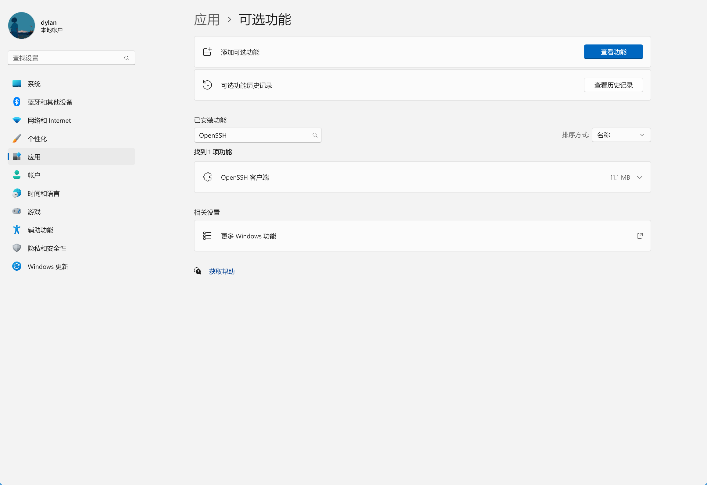

OpenSSH Client 在安装完毕后，其根目录会自动被添加到系统环境变量中：

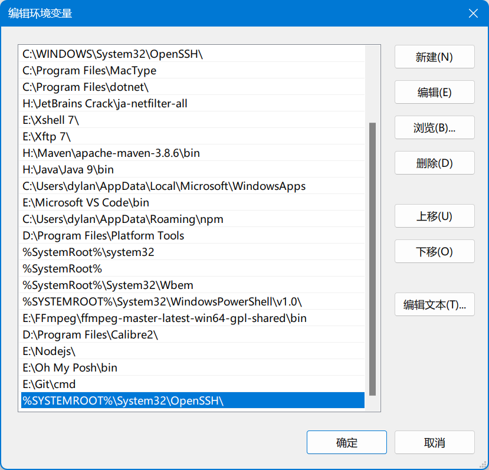

从环境变量可得知 OpenSSH Client 的根目录路径：

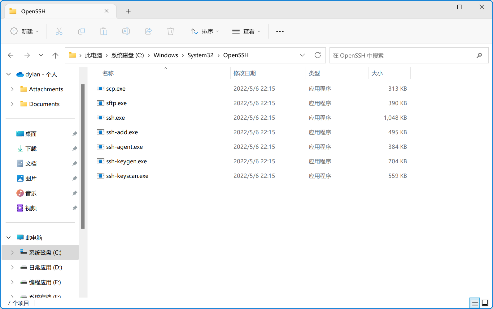

查看 OpenSSH 版本：

```bash
ssh -V
```

输出：

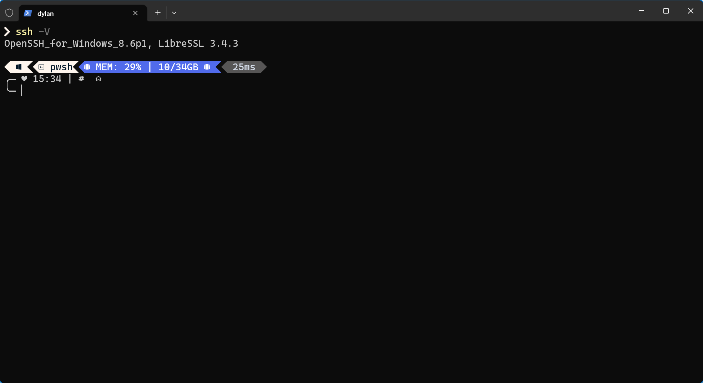

### OpenSSH 命令

OpenSSH 根目录下提供了所有与 SSH 连接相关的命令：


命令说明如下：

- `scp`：SCP（Secure Copy Protocol，安全复制协议）是一种安全的文件传输协议，它使用 SSH 协议来加密和保护文件的传输，确保数据在传输过程中的安全性；
- `sftp`：SFTP（Secure File Transfer Protocol，安全文件传输协议）是一种安全的文件传输协议，它建立在 SSH 协议之上，用于在本地计算机和远程服务器之间以加密和安全的方式传输文件；
- `ssh`：用于建立和管理 SSH（Secure Shell）连接。SSH 是一种安全的网络协议，用于远程登录到计算机以执行命令、管理文件和执行其他网络操作；
- `ssh-add`：Windows 系统下，该命令可以将 SSH 私钥添加到 SSH 代理（SSH Agent）中；
- `ssh-agent`：SSH 代理，用于管理 SSH **私钥**并提供身份验证凭据，以便用户在不需要重复输入密码或密钥短语的情况下进行 SSH 连接。它通常在 Windows 操作系统上运行，允许用户在登录会话期间将 SSH 私钥加载到代理中，以供后续使用；
- `ssh-keygen`：SSH（Secure Shell）工具包中的一个命令行工具，用于生成和管理 SSH 密钥对。SSH 密钥对由公钥和私钥组成，用于加密和解密通信，以及进行身份验证；
- `ssh-keyscan`：一个命令行工具，用于从远程 SSH 服务器上获取公共 SSH 主机密钥的信息。

其中较为常用的命令是 `ssh-keygen`、 `ssh` 。

#### ssh-keygen

`ssh-keygen` 用于生成和管理 SSH 秘钥对，直接使用即可生成秘钥对：

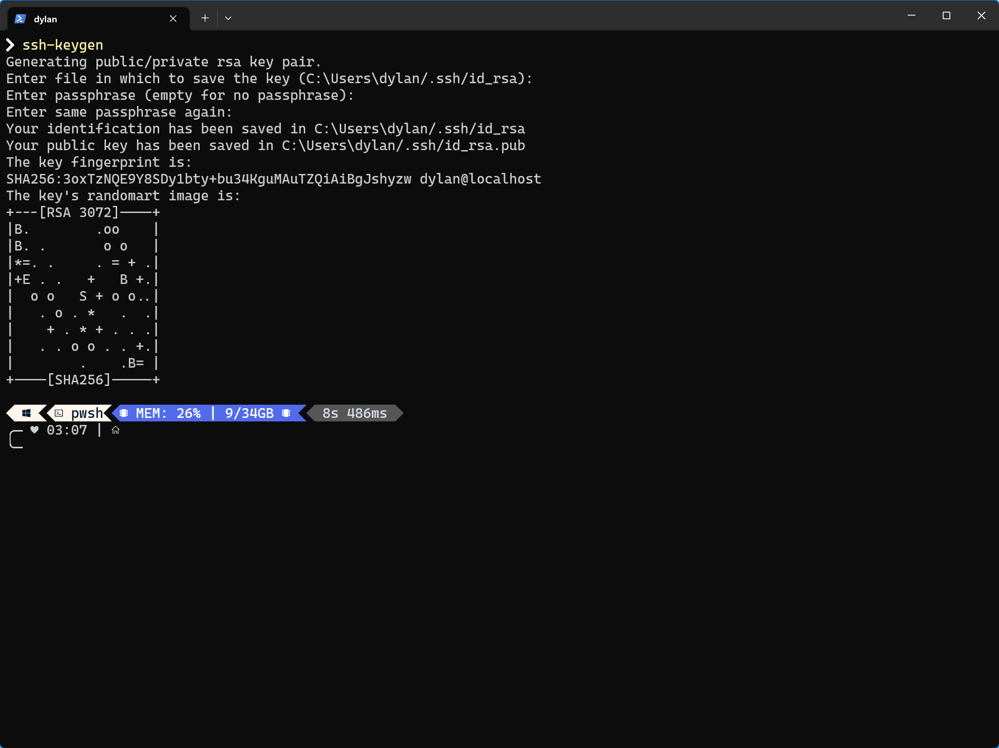

`ssh-keygen` 默认使用以下参数：

1. 密钥类型：RSA（非对称加密算法，Rivest-Shamir-Adleman）；
2. 密钥长度：2048 位（在较新的版本中，默认为 3072 位或更长）；
3. 密钥文件名称：`~/.ssh/id_rsa`（私钥）和 `~/.ssh/id_rsa.pub`（公钥）；
4. 不使用密码保护私钥文件。

`ssh-keygen` 本身没有提供类似于 `--help` 这样的参数，可选择查看在线的帮助文档：[ssh-keygen(1) - Linux man page](https://linux.die.net/man/1/ssh-keygen)。

或当错误地使用 `ssh-keygen` 命令时，终端会输出关于该命令的使用提示：

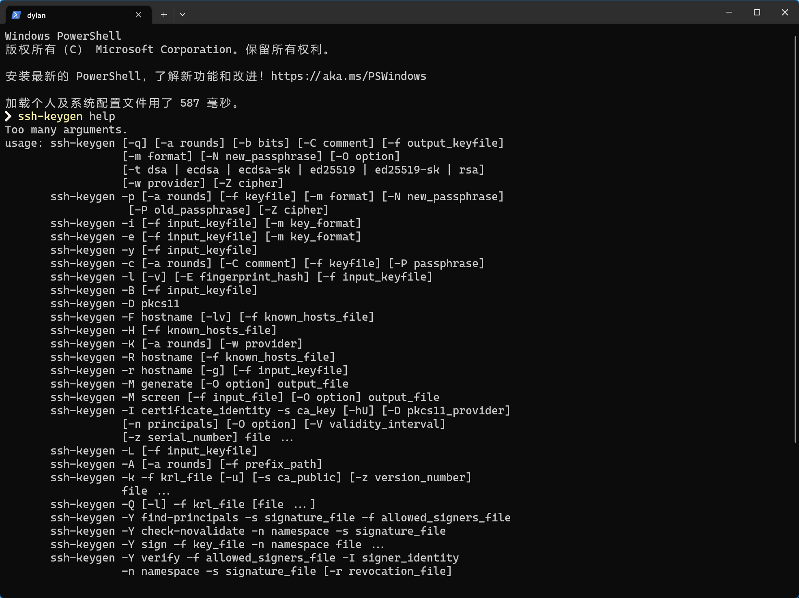

以下是常用的 `ssh-keygen` 命令参数及说明：

1. `-t`：指定密钥类型。常见的选项包括 `rsa`、`dsa`、`ecdsa` 和 `ed25519`。例如，`-t rsa` 会生成 RSA 密钥；
2. `-b`：指定密钥的位数，用于设置密钥的长度。较长的密钥通常更安全，但也需要更多的计算资源。例如，`-b 4096` 会生成一个 4096 位长的密钥；
3. `-f`：指定生成的密钥文件的名称和路径。例如，`-f ~/.ssh/my_key` 会将密钥文件命名为 "my_key" 并保存在 `~/.ssh` 目录中；
4. `-C`：为密钥添加注释。注释可以帮助您识别密钥的用途。例如，`-C "My SSH Key"`；
5. `-N`：设置私钥文件的密码。这可以增加密钥的安全性。如果您使用这个参数，使用私钥时将提示您输入密码；
6. `-q`：以静默模式运行，不输出额外的信息。这在自动化脚本中很有用；
7. `-y`：从现有私钥文件中提取公钥。这可以用于查看或复制现有密钥对的公钥；
8. `-l`：列出密钥的详细信息，包括密钥类型、位数和指纹。

这些参数可以组合使用，以满足您的具体需求。例如，要生成一个密码保护的 2048 位长的 RSA 密钥，并将其保存在指定路径下：

```bash
ssh-keygen -t rsa -b 2048 -f ~/.ssh/my_key -N mypassphrase
```

#### ssh

`ssh` 用于建立和管理 SSH（Secure Shell）连接，在此之前推荐了解一下 SSH 协议的链接格式。

一个完整的 SSH 链接看起来是这样的：

```
ssh://[user@]host/project_path.git
```

它通常被简写为 scp 式：

```
[user@]host:project_path.git
```

大多数情况下，能从网络上够获取到的 SSH 链接均会采用。

假如 GitHub 上有一个名为 dylan127c/sample 的 repo，那么它所对应的 SSH 链接就是：

```
git@github.com:dylan127c/sample.git
```

由于 `ssh` 命令仅用于建立和管理 SSH 连接，因此它仅关心是否能与服务端建立连接，而不关心具体需要连接的是哪个仓库。

因此 `ssh` 命令仅需要使用到 scp 式简写的 SSH 链接中的前半部分，即包含用户名称、服务端地址的那部分信息。

`ssh` 命令的基本使用格式为：

```
ssh [option] [user@]host
```

其中 `[user@]host` 表示远程主机的地址（IP 地址或主机名）。如果指定了用户名，该用户名就是登录到远程主机时要使用的用户名。

一些常见的选项参数如下：

- `-p`：指定 SSH 服务器的端口号；
- `-i`：指定用于身份验证的私钥文件；
- `-l`：指定要登录的用户名；
- `-X`：启用X11转发，用于图形界面应用程序的远程显示。

`ssh` 命令同样没有提供类似于 `--help` 这样的参数，Windows 系统下可选择参阅网络文档 [ssh(1) - Linux man page](https://linux.die.net/man/1/ssh)。

通过错误地使用 `ssh` 命令也能得到具体的用法文档：

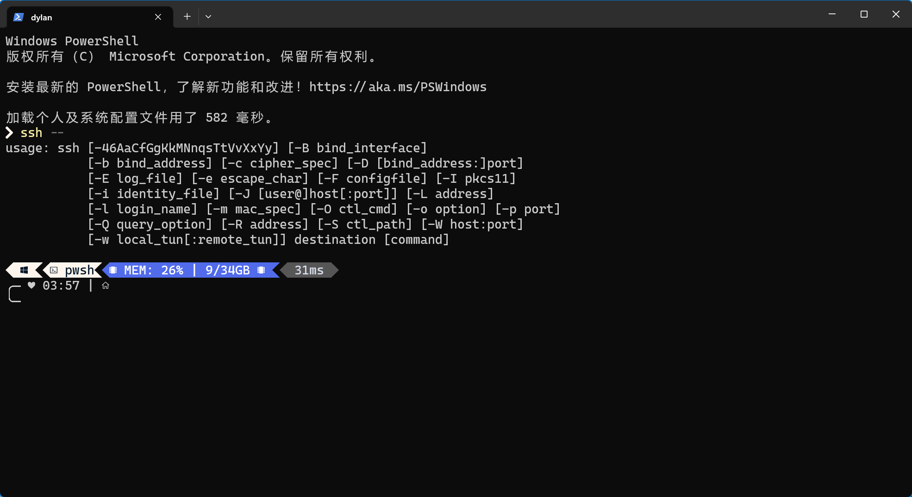


- 明天大纲，SSH 是用来连接服务器然后进行 Shell 操作的。因此需要使用 SSH 来模拟文件传输。
- Git 使用的是 SSH 和 HTTP(s) 连接中的文件传输功能。HTTPs 自不必多说，类似于登录网盘上传下载文件一样，有凭证就可以了。
- 只要能连接 GitHub 那么就能够完成文件传输。

```
ssh -T git@github.com
```

- Git 只是借助 OpenSSH 的功能，具体的配置都在 OpenSSH 中。Git 实际上只是敲命令行去使用 OpenSSH，只需要保证能连接到 host 

以上命令如果无法正常连接，则表示网络无法连通 GitHub 服务器，建议使用代理。

以下是一个用于与 GitHub 服务器建立连接的 OpenSSH 配置，其中 ProxyCommand 为代理配置：

```
Host github.com
	HostName %h
	Port 22
	IdentityFile ~/.ssh/for_connect
	ProxyCommand /e/Git/mingw64/bin/connect -S 127.0.0.1:13766 %h %p

Host ssh.github.com
	HostName %h
	Port 443
	IdentityFile ~/.ssh/for_connect
	ProxyCommand /e/Git/mingw64/bin/connect -S 127.0.0.1:13766 %h %p
```

由于 Windows 下的 OpenSSH 版本可能存在未知的差异，如果出现以下异常：

```
CreateProcessW failed error:2
posix_spawnp: No such file or directory
fatal: Could not read from remote repository.

Please make sure you have the correct access rights
and the repository exists.
```

则表示代理的路径有问题。将 OpenSSH 中的 ProxyCommand 修改为以下形式即可：

```
Host github.com
	HostName %h
	Port 22
	IdentityFile ~/.ssh/for_connect
	ProxyCommand E:/Git/mingw64/bin/connect -S 127.0.0.1:13766 %h %p

Host ssh.github.com
	HostName %h
	Port 443
	IdentityFile ~/.ssh/for_connect
	ProxyCommand E:/Git/mingw64/bin/connect -S 127.0.0.1:13766 %h %p
```

本文用于说明 OpenSSH 配置文件的构成及编写该文件时需要注意的一些事项。

### 配置文件的意义

SSH 配置文件可用于自定义 SSH 客户端的行为，以满足特定需求。该配置文件通常位于 `~/.ssh/config` 目录中。

文件内包含了用于配置 SSH 客户端的各种选项，以控制 SSH 客户端的具体行为，例如：

- 配置主机别名：使用 Host 块可以为不同的主机设置别名，在连接远程该主机时只需要提供别名即可连接目标主机，某些情况下简化一些操作；
- 配置身份验证的方式：使用 IdentityFile 选项可以指定 SSH 客户端在进行身份验证时使用什么验证文件，这样就不需要每次手动指定身份验证文件；
- 配置 SSH 连接选项：你可以使用各种选项来配置 SSH 连接的行为，例如连接超时时间、重试次数、使用的加密算法等等。
- 配置 SSH 代理：你可以使用 ProxyCommand 选项配置 SSH 代理，以便在使用 SSH 连接到无法直接访问的主机时使用。
- 配置 SSH 转发：你可以使用各种选项来配置 SSH 转发，例如本地端口转发、远程端口转发等等。

通过灵活使用 SSH 配置文件，你可以自定义 SSH 客户端的行为，使其更符合你的特定需求。此外，如果你需要经常连接到多个远程主机，使用 SSH 配置文件还可以节省你的时间和精力，提高你的工作效率。

### 完整的配置示例

一个完整的 SSH 配置文件可能会包含许多参数，其中大部分都是可选的。以下是一个包含所有可用参数的 SSH 配置文件示例：

```
# Global options
Host *
    ForwardAgent yes
    ForwardX11 yes
    Compression yes
    ServerAliveInterval 60
    ServerAliveCountMax 3

# Host-specific options
Host example.com
    HostName example.com
    User username
    Port 22
    IdentityFile ~/.ssh/my_private_key
    IdentitiesOnly yes
    PreferredAuthentications publickey,password
    Protocol 2
    Ciphers aes128-ctr,aes192-ctr,aes256-ctr
    MACs hmac-sha2-256,hmac-sha2-512
    BatchMode yes
    ConnectTimeout 10
    TCPKeepAlive yes
    LogLevel DEBUG
    UserKnownHostsFile ~/.ssh/known_hosts
    StrictHostKeyChecking ask
    VisualHostKey yes
    ControlMaster auto
    ControlPath ~/.ssh/master-%r@%h:%p
    ControlPersist 600

# Host-specific options for a wildcard pattern
Host *.example.com
    ProxyCommand ssh -q gateway.example.com nc -q0 %h %p
```

这个实例中包含了三个部分。

- 第一部分定义了一些全局选项，包括打开代理转发、X11 转发、压缩和保持 SSH 连接的时间。
- 第二部分定义了一个名为 example.com 的主机，指定了用户名、端口、身份验证密钥等选项。我们还定义了一些其他选项，如身份验证首选项、协议版本、加密算法、日志级别等。
- 第三部分定义了一个使用通配符 *.example.com 的主机，为它指定了一个代理命令，以便通过网关主机连接到目标主机。

请注意，实际使用时，你不需要在 SSH 配置文件中指定所有可用选项，而是根据需要选择性地指定需要的选项。

### 注意事项

本节主要说明配置文件中的一些细节问题。

#### 缩进不必要

在 SSH 配置文件中，使用缩进可以让文件更易于阅读和理解。但是，缩进不是必需的，你可以选择不使用缩进来编写 SSH 配置文件。

然而，如果你不使用缩进，则需要确保每个选项都位于独立的一行上，且选项名和选项值之间需要用空格隔开。以下是一个不使用缩进的 SSH 配置文件示例：

```
Host example.com
HostName example.com
User username
Port 22
IdentityFile ~/.ssh/my_private_key
IdentitiesOnly yes
PreferredAuthentications publickey,password
Protocol 2
Ciphers aes128-ctr,aes192-ctr,aes256-ctr
MACs hmac-sha2-256,hmac-sha2-512
BatchMode yes
ConnectTimeout 10
TCPKeepAlive yes
LogLevel DEBUG
UserKnownHostsFile ~/.ssh/known_hosts
StrictHostKeyChecking ask
VisualHostKey yes
ControlMaster auto
ControlPath ~/.ssh/master-%r@%h:%p
ControlPersist 600
```

在这个示例中，每个选项都位于独立的一行上，且选项名和选项值之间使用空格隔开。

请注意，即使不使用缩进，每个 Host 块的开头行也需要以“Host”开头，并且主机名称需要紧跟在后面。简而言之，配置之间是以“Host”作为分界的，每个配置都被称为 Host 块。

虽然可以不使用缩进来编写 SSH 配置文件，但还是建议使用缩进来提高文件的可读性和可维护性。

#### Host 块（别名）

使用 SSH 配置文件可以简化连接远程主机的操作，通过在 SSH 配置文件中定义 Host 块，你可以为不同的主机配置不同的选项，例如 HostName、User、IdentityFile 等等。

这样，当你要连接到某个主机时，只需要使用该主机在 SSH 配置文件中定义的别名，而不需要再次输入主机名、用户名、身份验证文件等信息。

例如，你在 SSH 配置文件中定义了以下 Host 块：

```
Host myserver
    HostName example.com
    User John
    IdentityFile ~/.ssh/my_private_key
```

那么，当你想要连接到 example.com 主机时，只需要使用以下命令即可：

```bash
ssh myserver
```

SSH 将会自动使用 HostName 为 example.com，User 为 John，IdentityFile 为 ~/.ssh/my_private_key 的配置。

这样，你就可以在连接到多个远程主机时，大大简化操作流程，提高工作效率。

但需要注意，无论 ssh 命令中提供什么样的命令，SSH 都会默认会先匹配 Host，之后再根据命令中是否提供了 User 来进一步确定连接地址。

例如，存以下的配置文件：

```
Host github.com
    HostName %h
    User John
    IdentityFile ~/.ssh/my_private_key
```

假设 GitHub 能够被正常访问，命令行发起以下连接请求：

```bash
ssh -T git@github.com
```

SSH 会先把主机名 github.com 取出来匹配 Host 别名，因为任何情况下它首先可能是一个别名。

如果存在 Host 为 github.com 的 Host 块时，SSH 会根据发起的请求是否具有 User 信息，来进一步确定是否使用配置中的默认 User 信息。

由于以上的连接请求中使用了指定的 User（git），因此它将覆盖配置中默认的 User（John）作为连接的发起者。

如果发起不带用户名的连接请求：

```bash
ssh -T github.com
```

它将直接匹配到 Host 别名中的配置，其等价于：

```bash
ssh -T John@github.com
```

现在修改一下配置文件：

```
Host alias
    HostName github.com
    User John
    IdentityFile ~/.ssh/my_private_key
```

由于别名的存在，如果希望访问到远程主机 github.com 则必须要在命令中使用别名：

```bash
ssh -T git@alias
```

诸如以下的 SSH 连接请求：

```bash
ssh -T github.com
ssh -T git@github.com
```

均无法成功匹配到 Host 块，这些请求一般会以找寻不到私钥的存在，导致验证失败而告终：

```
Permission denied (publickey).
```

之前说过，Host 一般用于分割配置，即如果存在多个配置，则 Host 必须提供。否则多个配置就会被视为同一个配置，这样是十分不合理的。

如果只有一个配置呢？是否可以省略 Host 配置？答案是肯定的，但实际并不推荐这样做。

假设存在以下配置：

```
HostName github.com
User John
IdentityFile ~/.ssh/my_private_key
```

该配置实际等价于：

```
Host github.com
    HostName %h
    User John
    IdentityFile ~/.ssh/my_private_key
```

即所有主机写作 github.com 的连接都会匹配这条规则。  

#### 大小写无限制

在 SSH 配置文件中，大小写通常是不敏感的。这意味着你可以使用大写字母、小写字母或混合大小写字母来编写选项名和主机名，它们都会被正确地解析和识别。例如，下面的两个 Host 块是等价的：

```
Host example.com
    HostName example.com
    User username
    IdentityFile ~/.ssh/my_private_key

host example.com
    hostname example.com
    user username
    identityfile ~/.ssh/my_private_key
```

无论你是使用大写字母、小写字母或混合大小写字母编写选项名和主机名，SSH 都会将它们解释为相同的选项名和主机名。因此，在 SSH 配置文件中，大小写通常是没有限制的。


### 文件传输

### 端口转发

SSH 端口转发技术也被称为 SSH 隧道（SSH Tunneling），它允许通过加密的 SSH 连接在本地和远程计算机之间安全地传输数据。在不信任的网络上可以使用 SSH 隧道安全地传输数据，它是远程访问、安全浏览和网络安全的重要工具。

#### 1. 本地端口转发

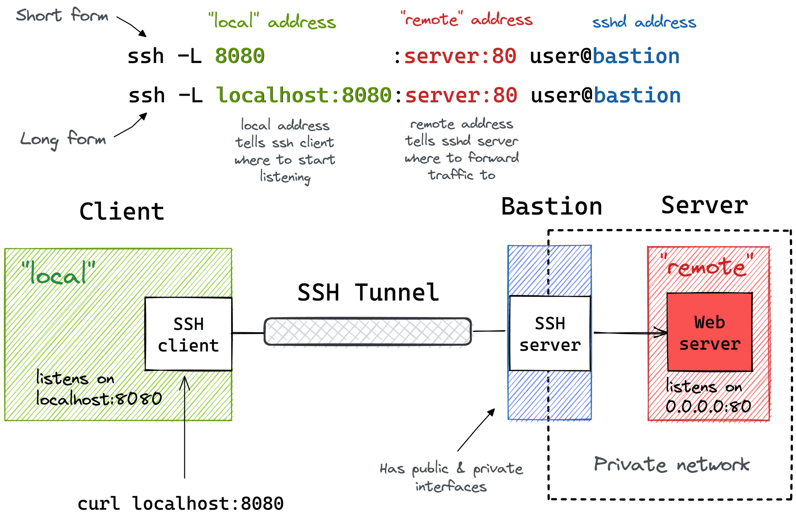

本地端口转发允许将本地某个端口的流量通过 SSH 隧道转发至远程服务器上，远程服务器会根据具体的转发配置，将流量中继至本机或其他的服务器。

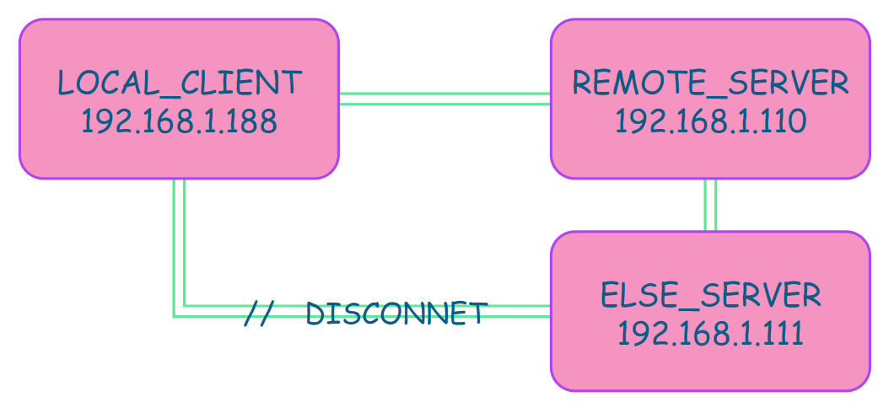

本地端口转发的本质是使用 SSH Client 监听本地端口以实现端口入站流量的转发。

以下是用于开启本地端口转发的命令，该命令需要在**发送流量（请求）的计算机**上执行：

```bash
ssh 'REMOTE_SERVER_USERNAME@REMOTE_SERVER' -L '[<LISTENING_INTERFACE>:]<LOCAL_CLIENT_PORT>:<ELSE_SERVER>:<ELSE_SERVER_PORT>'
```

以上命令可以简单拆解为两部分：

1. 建立连接：即建立 LOCAL_CLIENT 和 REMOTE_SERVER 之间的 SSH 连接。这是必不可少的步骤，因为本地端口转发依赖于 SSH 隧道；
2. 转发逻辑：
   - 监听流量：即配置 LOCAL_CLIENT 上的监听端口。SSH Client 会监听该端口上的入站流量，并转发到 REMOTE_SERVER 中；
   - 中继目标：即配置 ELSE_SERVER 及对应的 PORT。REMOTE_SERVER 在接收到流量时，会将流量中继至什么 ELSE_SERVER 的指定 PORT 上。

以下是流量的转发过程：

```
LOCAL_CLIENT:LOCAL_CLIENT_PORT ====SSH-TUNNEL====> REMOTE_SERVER:REMOTE_SERVER_PORT ==> ELSE_SERVER:ELSE_SERVER_PORT
```

默认情况下，SSH CLIENT 仅监听来自 localhost 的流量（本地流量），这意味着使用本机 IP 或本机映射的公网 IP 时 SSH CLIENT 无法完成监听。

如果希望监听来自本机 IP 或本机映射的公网 IP 的流量，可以将 LISTENING_INTERFACE 设定为 0.0.0.0 这个 IP 段，该设定表示允许 SSH CLIENT 监听来自任意地址的流量，这时候其他主机也通过 LOCAL_CLIENT 来连接至 REMOTE_SERVER。

对于本例来说，可以先忽略 LISTENING_INTERFACE 参数。在 LOCAL_CLIENT 上开启本地端口转发：

```bash
ssh 'root@192.168.1.110' -L '23152:192.168.1.111:22'
```

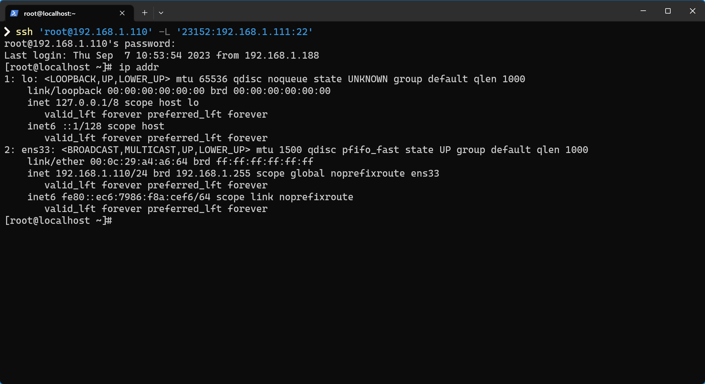

本地端口转发配置完毕后，LOCAL_CLIENT 如果需要和 ELSE_SERVER 建立 SSH 连接，那么只需要将 SSH 流量发送到本机的 23152 端口即可：

```bash
ssh '127.0.0.1' -l 'root' -p 23152
```

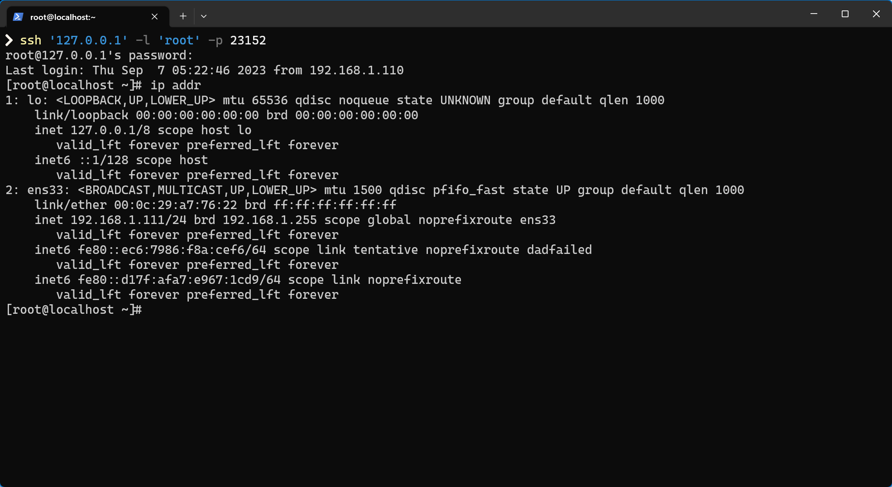

将 LISTENING_INTERFACE 参数设定为 0.0.0.0 以表示 SSH 隧道将接收来自任意地址的访问：

```bash
ssh 'root@192.168.1.110' -L '0.0.0.0:23152:192.168.1.111:22'
```

完成后，即可以 LOCAL_CLIENT 主机的真实 IP 地址来发起本地端口的 SSH 连接：

```bash
ssh '192.168.1.188' -l 'root' -p 23152
```


#### 2. 远程端口转发

远程端口转发允许将远程某个端口的流量通过 SSH 隧道转发至本地服务器上，本地服务器会根据具体配置，将流量中继至其他的服务器。


远程端口转发看似与本地端口转发相反，然而实际上它们最终所达目的是一致的：

- 本地端口转发：在 LOCAL_CLIENT 上执行命令，以开启本地 LOCAL_CLIENT 上端口转发功能。
- 远程端口转发：在 REMOTE_SERVER 上执行命令，以开启远程 LOCAL_CLIENT 上端口转发功能。

更简单地表达就是：

- 本地端口转发：指在本机执行配置命令，同时在本地开启端口转发；
- 远程端口转发：指在本机执行配置命令，但是在远程开启端口转发。

本例中，如果从 REMOTE_SERVER 的角度出发，那它相当于“本地服务器”，而 LOCAL_CLIENT 则相当于“远程客户端”。

配置远程端口转发的具体命令需要在**接收流量的计算机**（REMOTE_SERVER）上执行，格式如下：

```bash
ssh 'LOCAL_CLIENT_USERNAME@LOCAL_CLIENT' -R '[<LISTENING_INTERFACE>]<LOCAL_CLIENT_PORT>:<ELSE_SERVER>:<ELSE_SERVER_PORT>'
```

对于本例来说，忽略 LISTENING_INTERFACE 参数，具体的远程端口转发命令需要在 REMOTE_SERVER 上执行：

```bash
ssh 'dylan@192.168.1.188' -R '23152:192.168.1.111:22'
```

注意，请确保 LOCAL_CLIENT 上安装了 OpenSSH Server 并启用了 sshd 服务，否则 SSH 连接无法建立。

以上命令会在 REMOTE_SERVER 和 LOCAL_CLIENT 之间建立 SSH 连接，同时 SSH 会监听 LOCAL_CLIENT 的 23152 端口的入站流量。

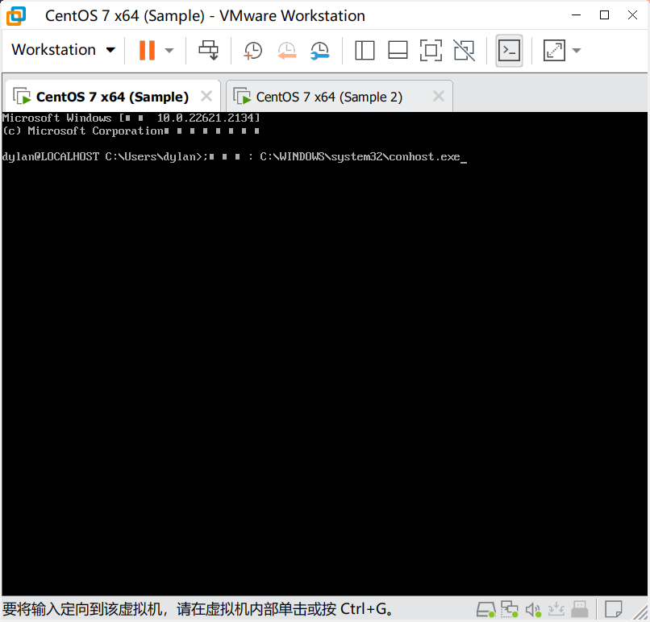

一旦 SSH 监听到 LOCAL_CLIENT 的 23152 端口存在入站流量时，就会通过 SSH 隧道发送该流量至 REMOTE_SERVER，REMOTE_SERVER 则将根据远程端口转发的配置将流量中继至 ELSE_SERVER。

此时 LOCAL_CLIENT 如果需要和 ELSE_SERVER 建立 SSH 连接，那么只需要将 SSH 流量发送到本机的 23152 端口即可：

```bash
ssh '127.0.0.1' -l 'root' -p 23152
```


#### 3. 动态端口转发

动态端口转发可以将主机上的 SSH 客户端变成一个 SOCKS 代理。假设 LOCAL_CLIENT 处于局域网，REMOTE_SERVER 处于广域网中。

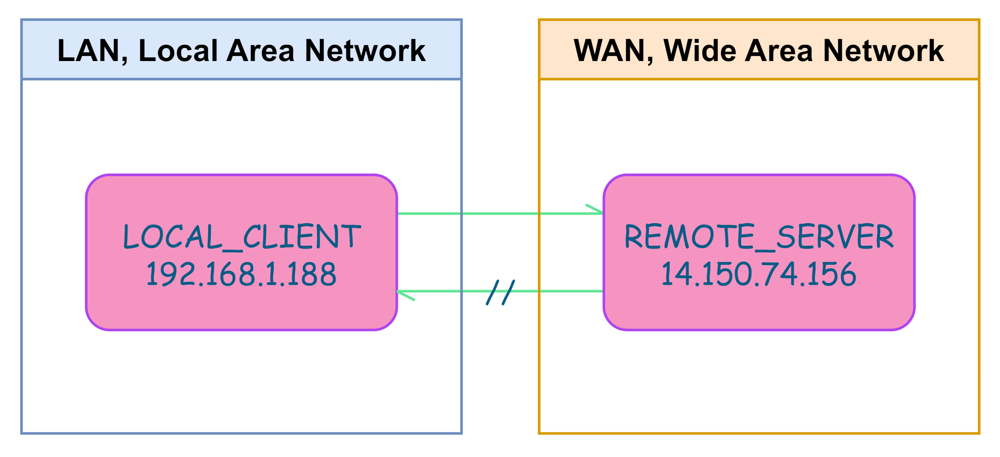

这种情况下 LOCAL_CLIENT 能够访问 REMOTE_SERVER，但 REMOTE_SERVER 无法访问 LOCAL_CLIENT。

这时候可以使用动态端口转发将 LOCAL_CLIENT 上的 SSH 客户端变成 SOCKS 代理：

```bash
ssh 'root@14.150.74.156' -D 57921
```


#### 4. 单向连接之类的


假设 REMOTE_SERVER 上安装了 VNC Server 服务，但 REMOTE_SERVER 不对外开放 5900 端口。

如果 LOCAL_CLIENT 希望使用 VNC Client 连接 REMOTE_SERVER，那么可以使用本地端口转发：

```bash
ssh 'root@14.150.74.156' -L '53720:localhost:5900'
```

本地转发开启，LOCAL_CLIENT 即可使用 VNC Client 连接以下地址：

```
127.0.0.1:53720
```

这时 VNC 流量会通过 SSH 隧道去往 REMOTE_SERVER，REMOTE_SERVER 会根据本地端口转发的配置，将流量中继给 REMOTE_SERVER 的 5900 端口，这样 REMOTE_SERVER 上的 VNC Server 就能间接地接收到来自 LOCAL_CLIENT 的 VNC Client 连接请求。

那么如果是 REMOTE_SERVER 希望使用 VNC Client 连接 LOCAL_CLIENT 上的 VNC Server 呢？答案显而易见，使用远程端口转发：

```bash
ssh 'root@14.150.74.156' -R '51381:localhost:5900'
```

远程转发开启，REMOTE_SERVER 即可使用 VNC Client 连接以下地址：

```
127.0.0.1:51381
```

这时 VNC 流量会通过 SSH 隧道去往 LOCAL_CLIENT，LOCAL_CLIENT 会根据远程端口转发的配置，将流量中继给 LOCAL_CLIENT 的 5900 端口，这样 LOCAL_CLIENT 上的 VNC Server 就能间接地接收到来自 REMOTE_SERVER 的 VNC Client 连接请求。

如果想透过其他的服务器访问 REMOTE_SERVER 来间接地访问 LOCAL_CLIENT，那么添加 LISTENING_INTERFACE 参数。

一般情况下，SSH Client 和 SSH Server 对于流量转发的监听策略如下：

- SSH Client：默认只监听 localhost 上的流量转发，GatewayPorts 默认为 yes；
- SSH Server：默认只监听 localhost 上的流量转发，GatewayPorts 默认为 no。

不希望只监听 localhost 上的流量转发，则需要添加 LISTENING_INTERFACE 参数同时将 GatewayPorts 设置为 yes。
