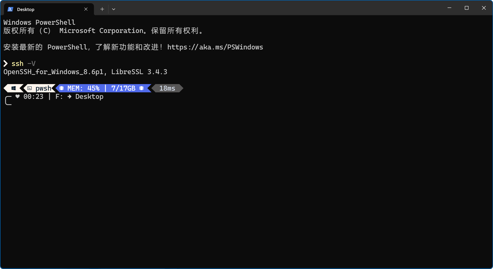
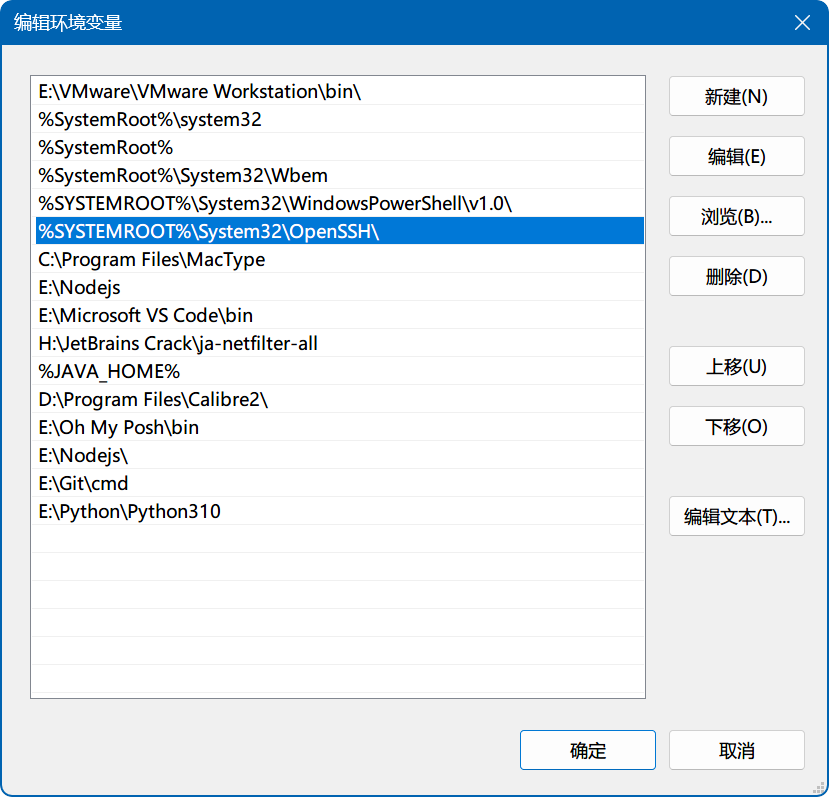

### 概述

OpenSSH（Open Secure Shell）是一个开源的网络协议和工具集，用于安全地在计算机网络上进行远程管理和数据通信。它的主要目的是提供加密的通信渠道，以保护敏感数据的传输，同时还提供了身份验证和远程访问控制功能。

### OpenSSH

Linux/Unix、macOS 或 Windows 系统中的标准 SSH 实现使用的均是 OpenSSH 工具集。OpenSSH 工具集分为 SSH Client 和 SSH Server，其中 SSH Client 一般内置于各个系统中。

使用以下命令可以查看 OpenSSH Client 的具体版本：

```bash
ssh -V
```

<div align="center"></div>

确认存在 SSH Client 之后，一般可以直接使用相关命令来建立 SSH 连接。

Windows 系统自 Windows 10 版本 1709 开始支持 OpenSSH，其中 SSH Client 默认安装。如果系统中没有，可以参考官方给出的 OpenSSH 安装步骤：[使用 Windows 设置来安装 OpenSSH](https://learn.microsoft.com/zh-cn/windows-server/administration/openssh/openssh_install_firstuse?tabs=gui#install-openssh-using-windows-settings)。

Windows 11 系统下，如若需要查看是否已安装 SSH Client 可转至“设置”搜索“可选功能”：

<div align="center"></div>

在“已安装功能”中检索“SSH”关键字：

<div align="center"></div>

如果系统已安装 SSH Client 则列表中会显示出来。

已安装 OpenSSH Client 的系统会自动将 OpenSSH 的安装目录添加至系统的环境变量中：

<div align="center"></div>

如果希望使用 OpenSSH Server 则可以选择“添加可选功能”上的“查看功能”并检索“SSH”关键词：

<div align="center"></div>

如无意外可以在检索结果中看到“OpenSSH Server”的安装包。

### 常用命令

OpenSSH 根目录下提供了所有与 SSH 连接相关的命令：

- `scp`：SCP（Secure Copy Protocol，安全复制协议）是一种安全的文件传输协议，它使用 SSH 协议来加密和保护文件的传输，确保数据在传输过程中的安全性；
- `sftp`：SFTP（Secure File Transfer Protocol，安全文件传输协议）是一种安全的文件传输协议，它建立在 SSH 协议之上，用于在本地计算机和远程服务器之间以加密和安全的方式传输文件；
- `ssh`：用于建立和管理 SSH（Secure Shell）连接。SSH 是一种安全的网络协议，用于远程登录到计算机以执行命令、管理文件和执行其他网络操作；
- `ssh-add`：Windows 系统下，该命令可以将 SSH 私钥添加到 SSH 代理（SSH Agent）中；
- `ssh-agent`：SSH 代理，用于管理 SSH **私钥**并提供身份验证凭据，以便用户在不需要重复输入密码或密钥短语的情况下进行 SSH 连接。它通常在 Windows 操作系统上运行，允许用户在登录会话期间将 SSH 私钥加载到代理中，以供后续使用；
- `ssh-keygen`：SSH（Secure Shell）工具包中的一个命令行工具，用于生成和管理 SSH 密钥对。SSH 密钥对由公钥和私钥组成，用于加密和解密通信，以及进行身份验证；
- `ssh-keyscan`：一个命令行工具，用于从远程 SSH 服务器上获取公共 SSH 主机密钥的信息。

<div align="center"></div>

#### 1. ssh & ssh-keygen

`ssh` 用于建立和管理 SSH（Secure Shell）连接，一个完整的 SSH 链接看起来是这样的：

```
ssh://[username@]hostname[:port]
```

其中 `[]` 内的参数可以省略，SSH 会默认使用当前系统登录用户的用户名称作为 `username`，默认端口 `22`。

假设 Windows 系统下登录用户名称为 dylan 那么以下 `ssh://` 链接等价：

```
ssh://dylan@hostname:22

ssh://hostname
```

如果远程 `host` 中部署了 SSH Server 且默认端口 `22` 未改变，那么本地即可使用 SSH Client 提供的 SSH 命令远程连接至目标 `host` 主机：

```bash
ssh root@hostname
```

以上命令在完成 `root` 用户的身份认证后，即可建立 SSH 连接。如果目标 `host` 主机提供 Shell 访问，那么建立连接后本地主机会立刻进入 `host` 主机的终端界面。

类似于 GitHub 这类仓库网站，它们提供 SSH 连接但不提供 Shell 访问，这意味着只能对这类主机做出有限的操作，例如上传、下载仓库数据等。

谈及建立远程连接，必然逃不开**身份验证（Authentication）**的问题，SSH 支持以下方式的身份验证：

- 用户账户密码验证
- 公钥验证

公钥验证简单来说即使用非对称加密生成的密钥对来完成验证，其中私钥存储在本地，公钥一般需要手动上传到远程主机。建立 SSH 连接时，程序会主动查询本地私钥以配对远程公钥完成身份验证。

通常使用 `ssh-keygen` 程序来生成 SSH 密钥对：

<div align="center"></div>

不添加任何参数的时候，会使用默认参数来生成密钥对，密钥对默认存储在 `~/.ssh/` 目录中，其中以 `.pub` 后缀命名的文件为公钥，未以该后缀命名的为私钥。

`ssh-keygen` 默认参数：

1. 密钥类型：`RSA`（非对称加密算法，Rivest-Shamir-Adleman）；
2. 密钥长度：2048 位（在较新的版本中，默认为 3072 位或更长）；
3. 密钥文件名称：`~/.ssh/id_rsa`（私钥）和 `~/.ssh/id_rsa.pub`（公钥）；
4. 不使用密码保护私钥文件。

注意，生成密钥对时使用的加密算法并不是越复杂越好，秘钥长度同样不是越长越好，安全性通常与加解密速度成反比，安全性越高通常意味着加解密效率越低，需根据实际情况选择适合的 `ssh-keygen` 参数。

如需深入了解 `ssh`、`ssh-keygen` 命令，可以参考文档：[ssh(1) - Linux man page](https://linux.die.net/man/1/ssh)、[ssh-keygen(1) - Linux man page](https://linux.die.net/man/1/ssh-keygen)。

#### 2. ssh-agent & ssh-add

尝试使用 SSH 命令建立远程连接时，如果使用公钥验证，那么需告知 SSH 程序私钥的存储位置。

一共有三种方式可以告知 SSH 程序私钥的存储位置：

- 通过命令行参数 `-i` 指定本次连接所使用的私钥的存储位置；
- 通过 `~/.ssh/config` 文件指定本地连接所使用的私钥的存储位置；
- 将私钥交给 `ssh-agent` 程序管理，以自动选择合适的私钥用于身份验证。

假设已经将 `id_rsa.pub` 公钥上传至 `github.com` 中，使用命令行参数可以指定私钥以用于身份验证：

```
~]# ssh -T git@github.com -i ~/.ssh/id_rsa
Hi dylan127c! You've successfully authenticated, but GitHub does not provide shell access.
```

其中 `-T` 参数表示 SSH 不需要在远程主机上启动交互式 shell 而仅需执行连接验证后立即退出。

上述例子中，有且返回以下消息时表示身份验证通过：

```
Hi xxxx! You've successfully authenticated, but GitHub does not provide shell access.
```

除了添加 `-i` 参数外，另一种方式是在 `./ssh` 目录下创建 `config` 配置：

```
Host github.com
    HostName %h
	IdentityFile ~/.ssh/id_rsa
```

其中：

- `Host` 是远程主机的别名；
- `HostName` 是远程主机的访问地址，其中 `%h` 表示引用 `Host` 中的值；
- `IdentityFile` 是用于公钥验证的私钥文件所在位置。

一般在 `Host` 直接使用远程主机的访问地址时，`HostName` 可以省略。

那么在建立访问 `github.com` 远程主机的 SSH 连接时，程序会自动搜索 `~/.ssh/config` 文件中的配置：

```
~]# ssh -T git@github.com
Hi dylan127c! You've successfully authenticated, but GitHub does not provide shell access.
```

最后一种身份验证的方式是将私钥交给 `ssh-agent` 自动管理。

使用 `ssh-agent` 需要确保 `ssh-agent` 服务处于“正在运行”状态：

<div align="center"></div>

`ssh-agent` 虽然是一个用于管理秘钥和完成身份验证的程序，但实际添加、删除或查看私钥等具体的操作并不由它直接完成，取而代之使用的是 `ssh-add` 程序。

通过 `ssh-add` 程序来完成添加、删除或查看私钥等具体操作：

```bash
# 添加私钥
ssh-add '~/.ssh/id.rsa'

# 删除私钥
ssh-add -d '~/.ssh/id.rsa'
```

其中添加或删除私钥时，都必须提供具体的私钥路径，这意味着私钥允许位于 `~/.ssh` 目录之外。

查看 `ssh-agent` 中管理的所有私钥同样需要使用 `ssh-add` 程序：

```
~]# ssh-add -l
3072 SHA256:20udsvEGWr6R6HaZg6Aca5kXlr7Rd/Zds6U2FG/NYFE id.rsa (RSA)
```

使用 `ssh-add` 添加指定私钥后，在建立 SSH 连接时，程序会自动使用 `ssh-agent` 进行身份验证：

```
~]# ssh -T git@github.com
Hi dylan127c! You've successfully authenticated, but GitHub does not provide shell access.
```

关于优先级的问题实际可以不管，任何时候都推荐仅使用以上的某一种方式来管理私钥，混合管理可能会导致一些问题。从系统兼容性的角度来说，更推荐使用 `~/.ssh/config` 配置文件的方式来管理私钥。

因为无法保证每个系统上都存在运行中的 `ssh-agent` 服务，同时更换系统之后，使用 `ssh-add` 批量添加私钥也是比较麻烦的操作。

#### 3. scp & sftp

`scp` 和 `sftp` 都是用于在本地系统和远程系统之间进行安全文件传输的工具，但它们有一些区别：

- `scp`（Secure Copy Protocol）是一个命令行工具，类似于 `cp` 命令，用于在本地系统和远程系统之间复制文件或目录，它不提供交互式的文件浏览和操作功能；
- `sftp`（SSH File Transfer Protocol）是一个交互式的文件传输协议，提供了一个类似于 FTP 的会话，允许用户在本地系统和远程系统之间进行浏览、上传、下载、删除等文件操作。

`scp` 更适合简单的文件复制操作，`sftp` 则适用于更复杂的文件传输需求，提供了更丰富的功能和交互性。

基本的 `scp` 命令格式：

```bash
scp [options] source destination
```

假设存在 `192.168.1.119` 支持 SSH 连接的远程主机，且有以下 `transfer.txt` 文件：

```
Hello, world!
```

传输 `transfer.txt` 文件到远程主机，只需使用以下 `scp` 命令：

```bash
scp ./transfer.txt root@192.168.1.119:~
```

<div align="center"></div>

输入用户 `root` 密码进行身份认证后，文件即刻开始传输到远程主机的 `~` 目录下：

<div align="center"></div>

修改 Linux 远程主机上的 `transfer.txt` 文件的内容：

```
Hi, world!
```

<div align="center"></div>

使用 `scp` 命令还可以从远程主机上复制文件到本地主机，本地执行以下命令：

```bash
scp root@192.168.1.119:~/transfer.txt .
```

<div align="center"></div>

另外 `scp` 命令支持传输目录，只需要添加 `-r` 参数：

```bash
scp -r source_folder destination
```

如果只需要在主机直接完成简单的文件传输任务，使用 `scp` 命令不失为一种好的选择，而另一种方式是使用 `sftp` 命令。`sftp` 是交互式的文件传输协议，以下命令可以打开一个 SFTP 会话：

```bash
sftp username@hostname
```

假设存在 `192.168.1.119` 支持 SSH 连接的远程主机，则建立 SFTP 会话的命令为：

```bash
sftp root@192.168.1.119
```

<div align="center"></div>

一旦成功连接到远程主机，就可以在 SFTP 提示符下执行各种文件操作命令。

常用的 SFTP 命令：

- `ls`：列出远程主机上的当前目录中的文件和目录；
- `cd`：更改远程主机上的当前工作目录；
- `get`：从远程主机下载文件到本地系统；
- `put`：上传本地文件到远程主机；
- `rm`：删除远程主机上的文件；
- `mkdir`：在远程主机上创建目录；
- `rmdir`：删除远程主机上的目录；
- `exit` 或 `quit`：退出 SFTP 会话；
- `help` ：获取更多可用命令的帮助信息。

Windows 系统下操作 Bash 需要注意 `put` 或 `get` 文件时本地主机的文件路径：

```bash
# 上传文件
put f:\desktop\transfer.txt /root

# 下载文件
get /root/transfer.txt f:\desktop
```

另外，SFTP 会话内的本地主机的 `.` 目录即为 Windows Terminal 开启 SFTP 会话时的所在目录。

对于 `sftp` 命令来说，了解基本的语法即可，并不推荐直接使用 `sftp` 命令进入 SFTP 会话内操作文件的上传或下载。**主要的原因是 SFTP 会话并不支持完整的交互式 Shell 操作，例如 `ll` 或 `Tab` 补全等。**

但无论 `scp` 还是 `sftp` 命令，它们在操作大量文件的上传或下载时还是过于复杂。如果有大量传输文件的需求，还是建议使用图形化的 SFTP 客户端来完成，例如 Xftp。

### SSH Client 配置

SSH Client 的配置文件（通常是 `~/.ssh/config`）是一个重要的工具，用于管理和自定义 SSH 连接。

SSH Client 配置中，缩进通常是可选的。但由于缩进有助于提高文件的可读性，通常情况下，配置文件中的每个主机别名都会顶格处理，主机别名相应的选项则会缩进处理，选项和参数之间则可选空格或制表符进一步缩进。

以 `github.com` 为例，一个常用的 SSH Client 配置：

```
Host mygithub
    HostName github.com
    Port 22
    User git
    IdentityFile ~/.ssh/id_rsa
    ProxyCommand e:/git/mingw64/bin/connect -S 127.0.0.1:13766 %h %p
```

那么以下 SSH 连接命令等价：

```bash
# 使用 Host（别名）连接
ssh -T 'mygithub'

# 以上命令等价于命令
ssh -T 'git@github.com' -p 22 -i '~/.ssh/id_rsa' -o 'ProxyCommand "e:/git/mingw64/bin/connect.exe" -S 127.0.0.1:13766 %h %p'
```

但多数情况下，只建议在 SSH Client 配置中写入关键配置，例如 `IdentityFile` 身份验证配置或 `ProxyCommand` 代理配置等。

修改后的 SSH Client 配置为：

```
Host github.com
    HostName %h
    Port 22
    IdentityFile ~/.ssh/id_rsa
    ProxyCommand e:/git/mingw64/bin/connect -S 127.0.0.1:13766 %h %p
```

这意味着别名 `Host` 与主机名称 `HostName` 一致，且在连接 `github.com` 时必须提供用户名称（git）：

```bash
# 使用 Host（别名）连接
ssh -T git@github.com

# 以上命令等价于命令
ssh -T 'git@github.com' -p 22 -i '~/.ssh/id_rsa' -o 'ProxyCommand "e:/git/mingw64/bin/connect.exe" -S 127.0.0.1:13766 %h %p'
```

上述配置可以进一步简化为：

```
Host github.com
    IdentityFile ~/.ssh/id_rsa
    ProxyCommand e:/git/mingw64/bin/connect -S 127.0.0.1:13766 %h %p
```

默认情况下 `HostName` 即为 `Host`、端口即为 22，因此 `HostName` 和 `Port` 均可省略。

SSH 客户端配置文件中存在“Host 块”的概念。每个“Host 块”包含一个或多个主机别名及其相关的配置选项。一个“Host 块”以 `Host` 关键字开头，后面跟着主机别名，然后是该主机的相关配置选项。例如：

```
Host example
    HostName example.com
    Port 22
    User username
    IdentityFile ~/.ssh/id_rsa
```

在这个示例中，`Host example` 就是一个“Host 块”，它包含主机别名为 `example` 的主机及其相关的配置选项。

另外，大多数情况下 SSH 客户端配置文件是不区分大小写的，但一些选项可能是大小写敏感的，这取决于具体的选项和实现。为了提高可读性，建议按照约定俗成的方式书写配置文件，但不必担心大小写问题。

最后关联一个和 GitHub 相关的 SSH 连接知识，一般来说会选用默认的 22 端口和 GitHub 建立 SSH 连接：

```bash
ssh -T 'git@github.com'
```

但如果由于某些原因，网络供应商或代理服务商不开放 22 端口的访问权限，那么一般的 SSH 连接无法建立。

那么此时如果希望和 GitHub 建立 SSH 连接，可以使用备用的 SSH 访问域名 `ssh.github.com` 并通过 HTTPS 端口（443）访问 GitHub 项目：

```bash
ssh -T 'git@ssh.github.com' -p 443 -i '~/.ssh/id_rsa' -o 'ProxyCommand "e:/git/mingw64/bin/connect.exe" -S 127.0.0.1:13766 %h %p'
```

这时候为了便于书写，可以添加配置：

```
Host ssh.github.com
	Port 443
	IdentityFile ~/.ssh/for_connect
	ProxyCommand e:/git/mingw64/bin/connect -S 127.0.0.1:13766 %h %p
```

之后就可以书写简化版的 SSH 连接命令了：

```bash
ssh -T 'git@ssh.github.com'
```

关于 `github.com` 和 `ssh.github.com` 两个远程主机，可以简单理解为这两个远程主机都可以直接访问到仓库数据，这里只需要关心对应的域名使用什么端口（22 或 443）才能与远程主机建立 SSH 连接即可。

毕竟只要能够建立 SSH 连接，那么文件就能够进行上传或下载。只要是能建立正常的 SSH 安全连接的域名和端口就行，不需要关心域名是不是 `github.com`，更不需要关心是不是 22 端口（**SSH Server 支持修改默认端口**）。
