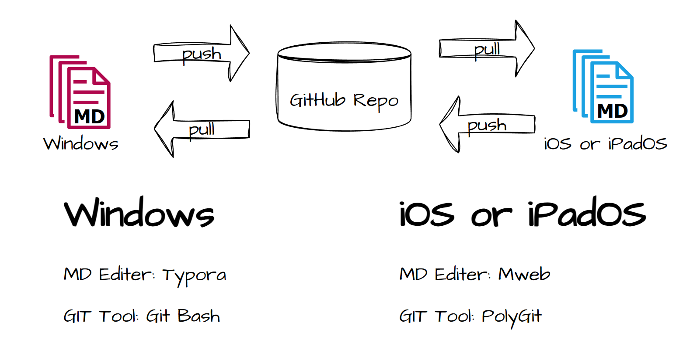

# notes-storage

This repository is only be used to save my personal markdown notes. 

Typora 是一款轻量级 Markdown 编辑器，适用于 OS X、Windows 和 Linux 三种操作系统。于个人而言，Typora 在 PC 端的表现十分优秀，但遗憾的是 Typora 并不支持移动端。

出于个人习惯，目前采用类似于“中转”的方案，即借助 GitHub 来完成 Markdown 文件在 PC 端和移动端之间同步，以实现在移动端阅读或编辑 Markdown 文件。移动端选择的 Markdown 编辑器为 Mweb，因为 Mweb 支持添加外部文件夹。不过其实只要是支持添加外部文件夹的 Markdown 编辑器就行，不一定非要用 Mweb。

需要注意，不同的 Markdown 编辑器大概率会采用不同的解析引擎，这可能导致解析的差异，因此建议使用更为标准的 Markdown 语法，标准语法至少能够保证文件在不同 Markdown 编辑器中阅读表现的一致。

一般来说，多数的异常是由不正确的转义所引起的。例如，在 Markdown 的表格中使用 <code>|</code> 竖线，一般需要对 <code>|</code> 进行转义。

但 Typora 允许在表格中直接使用竖线，而不需要额外添加 <code>\\</code> 转义符。显然，对于 Typora 来说这是一项优化，它能够显著减少用户在编写文件时所使用的代码量。

遗憾的是，这样的优化在交由 Mweb 编辑器解析时，会出现意想不到的错误。Mweb 会将未正常转义的竖线视为 Markdown 表格的结构之一，从而导致某些表格内容的显示缺失。

解决这种解析异常最直接的方式，就是尽可能少用或不用编辑器提供的特殊语法，并尽量使用更为标准的 Markdown 语法。
