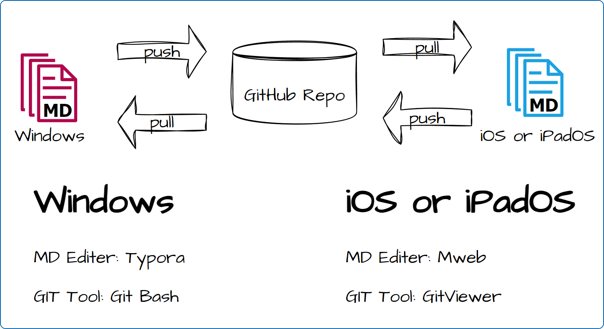

# notes-storage

This repository is used to save personal markdown notes. 

Note that some Markdown syntax is not universal for Typora and Mweb, such as escaping certain symbols. It is recommended to use the more general Markdown syntax when writing Typora.
